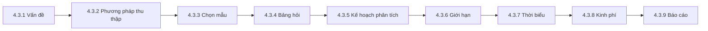

<!-- Bản sao tham chiếu của tài liệu học tập trên Claude Docs (xem ../lms_tai_lieu_hoc_tap.md). Bản trên Claude Docs là bản chính. -->

Học phần MKT1107 Nghiên cứu Marketing · Trường Đại học Kinh tế – Tài chính TP.HCM (UEF) · Giảng viên: Đoàn Nguyễn Bảo Quyên · Tài liệu dùng cho Buổi 6 và 9 giờ tự học của Bài 4.

## Mục tiêu bài học

Học xong bài này, bạn có thể:

1. Giải thích các khái niệm: thiết kế nghiên cứu, khoảng trống nghiên cứu, mục tiêu, câu hỏi, giả thuyết, khung lý thuyết.
2. Chuyển một vấn đề quản trị thành vấn đề nghiên cứu và mục tiêu nghiên cứu đạt chuẩn SMART.
3. Nhận diện các yếu tố môi trường ảnh hưởng đến vấn đề nghiên cứu.
4. Viết được đề cương nghiên cứu marketing gồm 9 nội dung (4.3.1–4.3.9) cho dự án của nhóm.

**Vị trí của bài trong dự án:** Bài 1–3 giúp nhóm chọn đề tài và đọc tài liệu. Bài 4 gom tất cả lại thành **đề cương nghiên cứu (M4)** — bản kế hoạch mà nhóm sẽ thực hiện trong phần còn lại của học phần. Các bài 5–10 sẽ đi sâu từng nội dung của đề cương.

## 4.1 Một số khái niệm trong nghiên cứu

### 4.1.1 Thiết kế nghiên cứu

**Thiết kế nghiên cứu** là bản kế hoạch tổng thể cho biết nhà nghiên cứu sẽ thu thập và phân tích thông tin như thế nào để trả lời câu hỏi nghiên cứu. Nó giống bản vẽ trước khi xây nhà: xác định cần thông tin gì, lấy từ ai, bằng cách nào, phân tích ra sao.

### 4.1.2 Ý tưởng và khoảng trống nghiên cứu

Ý tưởng nghiên cứu thường đến từ hai nguồn: **thực tiễn** (một vấn đề doanh nghiệp đang gặp) và **tài liệu** (điều các nghiên cứu trước chưa trả lời). **Khoảng trống nghiên cứu (research gap)** là phần kiến thức còn thiếu mà nghiên cứu của bạn sẽ bù vào. Các dạng khoảng trống thường gặp:

| Dạng khoảng trống | Ví dụ (giả định) |
|---|---|
| Bối cảnh mới | Nhiều nghiên cứu về ý định mua mỹ phẩm ở Hàn Quốc, ít nghiên cứu ở sinh viên TP.HCM |
| Đối tượng mới | Nghiên cứu về ví điện tử chủ yếu khảo sát người đi làm, chưa tập trung vào sinh viên |
| Hiện tượng mới | Mua sắm qua livestream phát triển nhanh, nghiên cứu còn ít |
| Kết quả mâu thuẫn | Một số nghiên cứu thấy giá ảnh hưởng mạnh, số khác thấy không ảnh hưởng |

Với dự án sinh viên, khoảng trống “bối cảnh mới” hoặc “đối tượng mới” là đủ và thực tế nhất.

### 4.1.3 Mục tiêu → câu hỏi → giả thuyết nghiên cứu

- **Mục tiêu tổng quát:** điều nghiên cứu muốn đạt được nói chung (một câu).
- **Mục tiêu cụ thể:** chia nhỏ mục tiêu tổng quát thành 2–4 việc cụ thể, bắt đầu bằng động từ đo được (xác định, đo lường, so sánh, đề xuất).
- **Câu hỏi nghiên cứu:** mỗi mục tiêu cụ thể viết lại thành một câu hỏi.
- **Giả thuyết nghiên cứu:** câu trả lời dự kiến, có thể kiểm định bằng dữ liệu (chỉ có trong nghiên cứu định lượng).

*Ví dụ (giả định) — đề tài ý định mua mỹ phẩm nội địa của sinh viên TP.HCM:*

| Mục tiêu cụ thể | Câu hỏi nghiên cứu | Giả thuyết |
|---|---|---|
| Xác định các yếu tố ảnh hưởng đến ý định mua | Những yếu tố nào ảnh hưởng đến ý định mua? | H1: Nhận thức về giá có ảnh hưởng tích cực đến ý định mua |
| So sánh ý định mua giữa sinh viên nam và nữ | Ý định mua có khác nhau giữa nam và nữ không? | H2: Có sự khác biệt về ý định mua giữa nam và nữ |
| Đề xuất hàm ý cho thương hiệu nội địa | Thương hiệu nên ưu tiên cải thiện điều gì? | (không cần giả thuyết) |

### 4.1.4 Khung lý thuyết: định tính và định lượng

| | Nghiên cứu định tính | Nghiên cứu định lượng |
|---|---|---|
| Cách lập luận | **Quy nạp:** từ dữ liệu rút ra nhận định | **Suy diễn:** từ lý thuyết đặt giả thuyết rồi kiểm định |
| Vai trò của lý thuyết | Định hướng câu hỏi, không áp đặt | Là cơ sở xây dựng mô hình và giả thuyết |
| Sản phẩm của chương cơ sở lý thuyết | Các khái niệm chính, khía cạnh cần tìm hiểu | Mô hình nghiên cứu (sơ đồ các biến) + giả thuyết H1, H2… |
| Báo cáo dự án trong học phần | 3 chương | 5 chương |

## 4.2 Vấn đề nghiên cứu

### 4.2.1 Tổng quan về vấn đề nghiên cứu

Xác định vấn đề là bước quan trọng nhất của cả dự án: xác định sai thì mọi bước sau dù làm tốt cũng trả lời sai câu hỏi. Cần phân biệt hai loại vấn đề:

| | Vấn đề quản trị (quyết định) | Vấn đề nghiên cứu |
|---|---|---|
| Câu hỏi | Nhà quản trị cần **làm gì**? | Cần **thông tin gì** để ra quyết định đó? |
| Hướng tới | Hành động | Thông tin |
| Tập trung vào | Triệu chứng | Nguyên nhân cơ bản |
| Ví dụ (giả định) | Có nên giảm giá để lấy lại doanh số không? | Đo lường mức nhạy cảm về giá và phản ứng của khách hàng mục tiêu với các mức giảm giá |
| Ví dụ (giả định) | Có nên mở thêm cửa hàng gần trường đại học? | Xác định nhu cầu, mức chi tiêu và thói quen mua của sinh viên khu vực đó |

**Mục tiêu nghiên cứu tốt theo chuẩn SMART:**

| Tiêu chí | Ý nghĩa | Kiểm tra |
|---|---|---|
| S – Specific | Cụ thể | Nói rõ ai, cái gì, ở đâu? |
| M – Measurable | Đo lường được | Có biết khi nào đã đạt không? |
| A – Achievable | Khả thi | Với thời gian, kinh phí, kỹ năng của nhóm có làm được không? |
| R – Relevant | Phù hợp | Có phục vụ quyết định quản trị không? |
| T – Time-bound | Có thời hạn | Hoàn thành khi nào? |

*Ví dụ:* “Tìm hiểu về mỹ phẩm” (chưa đạt) → “Xác định và đo lường mức ảnh hưởng của các yếu tố đến ý định mua mỹ phẩm nội địa của sinh viên tại TP.HCM, khảo sát trong học kỳ này” (đạt).

### 4.2.2 Quá trình xác định vấn đề nghiên cứu

| Bước | Việc cần làm | Với dự án sinh viên |
|---|---|---|
| 1. Thảo luận với người ra quyết định | Làm rõ: bối cảnh vấn đề; các phương án hành động đang cân nhắc; tiêu chí dùng để chọn phương án; thông tin cần để ra quyết định | Nhóm đóng vai nhà quản trị của thương hiệu đã chọn, viết ra quyết định cần đưa ra |
| 2. Phỏng vấn chuyên gia | Hỏi người am hiểu ngành để tránh nhìn sai vấn đề | Hỏi giảng viên, người làm trong ngành, nhân viên bán hàng |
| 3. Phân tích dữ liệu thứ cấp | Đọc báo cáo ngành, số liệu, nghiên cứu trước | Đã làm trong M2–M3 (tổng quan tài liệu) |
| 4. Nghiên cứu định tính sơ bộ | Phỏng vấn nhanh vài khách hàng để kiểm tra hiểu biết ban đầu | Trò chuyện với 3–5 bạn thuộc đối tượng nghiên cứu |

### 4.2.3 Yếu tố môi trường ảnh hưởng đến vấn đề nghiên cứu

Khi xác định vấn đề, cần xem xét năm nhóm yếu tố môi trường:

| Yếu tố | Câu hỏi cần trả lời |
|---|---|
| 1. Thông tin quá khứ và dự báo | Doanh số, thị phần, xu hướng ngành đã và sẽ thay đổi thế nào? |
| 2. Nguồn lực và hạn chế | Thời gian, kinh phí, nhân lực, kỹ năng cho phép nghiên cứu đến đâu? |
| 3. Mục tiêu của người ra quyết định | Mục tiêu của tổ chức và mục tiêu cá nhân của nhà quản trị là gì? |
| 4. Hành vi người tiêu dùng | Ai mua, mua gì, khi nào, ở đâu, vì sao? |
| 5. Môi trường vĩ mô | Kinh tế, pháp luật, công nghệ, văn hóa – xã hội có gì tác động? |

Với dự án sinh viên, yếu tố 2 (nguồn lực và hạn chế) quyết định phạm vi: một nhóm 2–3 người, không có kinh phí, khoảng 7 tuần để thu và phân tích dữ liệu — nên chọn đối tượng dễ tiếp cận và vấn đề đủ hẹp.

## 4.3 Đề cương nghiên cứu marketing

**Đề cương nghiên cứu** là văn bản trình bày kế hoạch nghiên cứu trước khi thực hiện. Trong doanh nghiệp, đề cương giống một **hợp đồng cam kết** giữa người nghiên cứu và người sử dụng kết quả: hai bên thống nhất sẽ nghiên cứu gì, bằng cách nào, khi nào xong, tốn bao nhiêu. Trong học phần, đề cương là bài nộp M4 và là bộ khung cho báo cáo cuối kỳ.

Đề cương gồm 9 nội dung:

### 4.3.1 Xác định vấn đề nghiên cứu

Trình bày: bối cảnh và lý do chọn đề tài (có trích dẫn), vấn đề quản trị, vấn đề nghiên cứu, mục tiêu tổng quát và cụ thể, câu hỏi nghiên cứu, đối tượng và phạm vi nghiên cứu (ai, ở đâu, khi nào). Dùng các kiến thức ở mục 4.1–4.2.

Lưu ý phân biệt: **đối tượng nghiên cứu** là vấn đề được nghiên cứu (ví dụ: các yếu tố ảnh hưởng đến ý định mua); **đối tượng khảo sát** là những người trả lời (ví dụ: sinh viên đang học tại TP.HCM).

### 4.3.2 Xác định phương pháp cơ bản để thu thập thông tin

Nêu rõ: loại nghiên cứu (khám phá / mô tả / nhân quả — Bài 1), dữ liệu thứ cấp sẽ dùng, dữ liệu sơ cấp sẽ thu và bằng phương pháp nào (chi tiết ở Bài 5).

| Hướng dự án | Phương pháp thu thập thường dùng |
|---|---|
| Định tính (3 chương) | Phỏng vấn sâu 6–10 người hoặc 1–2 cuộc thảo luận nhóm |
| Định lượng (5 chương) | Nghiên cứu định tính sơ bộ (điều chỉnh thang đo) + khảo sát bằng bảng hỏi trực tuyến |

### 4.3.3 Xác định phương pháp chọn mẫu nghiên cứu

Nêu: tổng thể nghiên cứu, khung mẫu (nếu có), phương pháp chọn mẫu, kích thước mẫu dự kiến và lý do (chi tiết ở Bài 6). Dự án sinh viên thường dùng mẫu thuận tiện hoặc định mức — hãy nói thẳng điều này và ghi nhận hạn chế ở mục 4.3.6.

### 4.3.4 Xây dựng bảng câu hỏi

Ở giai đoạn đề cương, chỉ cần trình bày **khung** công cụ thu thập:

- **Định lượng:** danh sách các khái niệm cần đo, mỗi khái niệm dự kiến dùng thang đo nào, kế thừa từ tác giả nào; cấu trúc 3 phần của bảng hỏi (gạn lọc – nội dung chính – thông tin cá nhân).
- **Định tính:** các chủ đề chính của dàn bài phỏng vấn.

Bảng hỏi hoàn chỉnh sẽ được thiết kế chi tiết ở Bài 7 (đo lường) và Bài 8 (thiết kế bảng câu hỏi).

*Ví dụ (giả định) — bảng khung thang đo trong đề cương:*

| Khái niệm | Số biến quan sát dự kiến | Thang đo | Nguồn kế thừa |
|---|---|---|---|
| Nhận thức về giá | 3–4 | Likert 5 điểm | [Tác giả, năm] từ tổng quan tài liệu của nhóm |
| Ý định mua | 3 | Likert 5 điểm | [Tác giả, năm] |
| Giới tính, năm học | 1 mỗi biến | Định danh | — |

### 4.3.5 Xây dựng kế hoạch phân tích các số liệu

Kế hoạch phân tích trả lời: **với mỗi câu hỏi nghiên cứu, nhóm sẽ xử lý dữ liệu bằng cách nào?** Lập kế hoạch trước giúp nhóm thiết kế bảng hỏi đúng loại thang đo cần cho phép phân tích — tránh trường hợp thu dữ liệu xong mới phát hiện không phân tích được.

*Ví dụ (giả định) — dự án định lượng:*

| Câu hỏi nghiên cứu | Biến liên quan | Kỹ thuật phân tích | Công cụ |
|---|---|---|---|
| Đặc điểm mẫu khảo sát ra sao? | Giới tính, năm học, chi tiêu | Tần số, tỷ lệ % (phân tích mô tả) | SPSS / Excel / Google Sheets |
| Mức đánh giá của sinh viên về từng yếu tố ra sao? | Các biến Likert | Trung bình, độ lệch chuẩn | Như trên |
| Ý định mua có khác nhau giữa nam và nữ không? | Giới tính × ý định mua | Phân tích nhị biến (kiểm định khác biệt) | Như trên |
| Các yếu tố có liên hệ với ý định mua không? | Yếu tố × ý định mua | Tương quan | Như trên |

Trong học phần, phân tích yêu cầu dừng ở **mô tả, đơn biến, nhị biến** (Bài 9). Phân tích sâu hơn (Cronbach’s Alpha, EFA, hồi quy…) là không bắt buộc và được **điểm cộng**.

Với dự án định tính: nêu cách gỡ băng phỏng vấn, mã hóa theo chủ đề và cách trình bày kết quả (bảng chủ đề kèm trích dẫn nguyên văn của người tham gia, đã ẩn danh).

### 4.3.6 Nêu giới hạn của công trình nghiên cứu

Mọi nghiên cứu đều có giới hạn. Nêu trước giới hạn thể hiện sự trung thực và giúp người đọc dùng kết quả đúng mức.

| Loại giới hạn | Cách viết (ví dụ) |
|---|---|
| Phạm vi | “Nghiên cứu chỉ khảo sát sinh viên tại TP.HCM, không đại diện cho người tiêu dùng nói chung.” |
| Phương pháp chọn mẫu | “Mẫu được chọn thuận tiện nên không thể khái quát hóa kết quả cho tổng thể.” |
| Kích thước mẫu | “Cỡ mẫu nhỏ hạn chế việc so sánh giữa các nhóm nhỏ.” |
| Dữ liệu tự báo cáo | “Người trả lời có thể trả lời theo hướng được xã hội mong đợi.” |
| Thời gian | “Dữ liệu thu tại một thời điểm, chưa phản ánh thay đổi theo thời gian.” |

### 4.3.7 Xác định thời biểu tiến hành nghiên cứu

Thời biểu liệt kê các công việc, người phụ trách và thời gian hoàn thành, thường trình bày bằng bảng hoặc biểu đồ Gantt. Gợi ý thời biểu theo lịch học phần (nhóm tự điền người phụ trách và ngày cụ thể theo lịch học của lớp):

| Công việc | Thời gian (theo buổi học) | Người phụ trách |
|---|---|---|
| Hoàn thiện đề cương (M4) | Sau Buổi 6 | Cả nhóm |
| Chọn phương pháp thu thập, kế hoạch mẫu | Buổi 7–8 | |
| Xây dựng thang đo, bản nháp bảng hỏi / dàn bài | Buổi 9–10 | |
| Nộp bài giữa kỳ trên LMS (kèm nháp bảng hỏi) | Trước Buổi 11 | |
| Thử nghiệm, hoàn thiện bảng hỏi; phát hành | Buổi 11–12 | |
| Thu dữ liệu xong; làm sạch, mã hóa, phân tích | Đến Buổi 13 | |
| Viết báo cáo cuối kỳ | Sau Buổi 13 | |

### 4.3.8 Ước lượng kinh phí nghiên cứu

Trong doanh nghiệp, kinh phí gồm: chi phí nhân sự (thiết kế, phỏng vấn viên, phân tích), chi phí thu thập dữ liệu (in ấn, đi lại, quà cảm ơn người trả lời, phí nền tảng khảo sát), chi phí mua dữ liệu thứ cấp, chi phí phần mềm, báo cáo và dự phòng.

Với dự án sinh viên, kinh phí thường rất nhỏ hoặc bằng 0 (dùng công cụ khảo sát miễn phí, phần mềm có bản miễn phí). Nhóm vẫn nên lập bảng kinh phí để luyện kỹ năng và ghi rõ khoản nào bằng 0 vì sao.

| Khoản mục | Diễn giải | Thành tiền |
|---|---|---|
| Công cụ khảo sát trực tuyến | Bản miễn phí | 0 |
| Quà cảm ơn người tham gia phỏng vấn (nếu có) | Số người × đơn giá | Nhóm tự ước tính |
| Đi lại, in ấn (nếu có) | | Nhóm tự ước tính |
| Dự phòng | Khoảng 10% tổng | |

### 4.3.9 Soạn thảo báo cáo tổng kết

Nêu trước hình thức và cấu trúc báo cáo sẽ nộp (chi tiết ở Bài 10):

| Dự án định lượng — 5 chương | Dự án định tính — 3 chương |
|---|---|
| Chương 1. Giới thiệu nghiên cứu | Chương 1. Giới thiệu và cơ sở lý thuyết |
| Chương 2. Cơ sở lý thuyết và mô hình nghiên cứu | Chương 2. Phương pháp nghiên cứu |
| Chương 3. Phương pháp nghiên cứu | Chương 3. Kết quả, kết luận và hàm ý |
| Chương 4. Kết quả nghiên cứu | |
| Chương 5. Kết luận và hàm ý quản trị | |
| Tài liệu tham khảo (APA 7), phụ lục (bảng hỏi, kết quả xử lý), nhật ký AI | Tài liệu tham khảo (APA 7), phụ lục (dàn bài, biên bản đã ẩn danh), nhật ký AI |

## Tóm tắt bài học

- Thiết kế nghiên cứu là bản vẽ tổng thể: cần thông tin gì, từ ai, bằng cách nào, phân tích ra sao.
- Đi theo chuỗi: vấn đề quản trị → vấn đề nghiên cứu → mục tiêu (SMART) → câu hỏi → giả thuyết (nếu định lượng).
- Định tính lập luận quy nạp; định lượng lập luận suy diễn với mô hình và giả thuyết.
- Xác định vấn đề qua 4 bước và xem xét 5 yếu tố môi trường; với sinh viên, nguồn lực và hạn chế quyết định phạm vi.
- Đề cương gồm 9 nội dung (4.3.1–4.3.9), là “hợp đồng” cho toàn bộ dự án.
- Lập kế hoạch phân tích trước khi thiết kế bảng hỏi; nêu giới hạn một cách trung thực.

## Thuật ngữ chính

| Tiếng Việt | Tiếng Anh |
|---|---|
| Thiết kế nghiên cứu | Research design |
| Khoảng trống nghiên cứu | Research gap |
| Vấn đề quản trị / vấn đề nghiên cứu | Management decision problem / marketing research problem |
| Mục tiêu nghiên cứu | Research objective |
| Giả thuyết | Hypothesis |
| Khung lý thuyết / mô hình nghiên cứu | Theoretical framework / research model |
| Quy nạp / suy diễn | Inductive / deductive |
| Đề cương nghiên cứu | Research proposal |

## Câu hỏi ôn tập

1. Phân biệt vấn đề quản trị và vấn đề nghiên cứu. Cho một ví dụ từ đề tài của nhóm bạn.
2. Viết lại mục tiêu “Nghiên cứu về trà sữa” thành mục tiêu đạt chuẩn SMART.
3. Vì sao nghiên cứu định tính thường không có giả thuyết?
4. Nêu 4 bước xác định vấn đề nghiên cứu và cách nhóm bạn thực hiện từng bước.
5. Vì sao cần lập kế hoạch phân tích trước khi thiết kế bảng hỏi?
6. Phân biệt đối tượng nghiên cứu và đối tượng khảo sát.
7. Viết hai giới hạn có thể có cho dự án của nhóm bạn.

## Liên hệ dự án nhóm — M4

**M4 – Đề cương nghiên cứu** (nhóm, 7,5%, nộp sau Buổi 6). Danh sách tự kiểm tra:

- [ ] Đủ 9 nội dung 4.3.1–4.3.9
- [ ] Vấn đề quản trị và vấn đề nghiên cứu được viết tách biệt
- [ ] Mục tiêu cụ thể đạt SMART; mỗi mục tiêu có câu hỏi nghiên cứu tương ứng
- [ ] Định lượng: có mô hình nghiên cứu và giả thuyết dựa trên tổng quan tài liệu (M3)
- [ ] Ghi rõ hướng dự án: định tính (3 chương) hay định lượng (5 chương)
- [ ] Bảng kế hoạch phân tích khớp với từng câu hỏi nghiên cứu
- [ ] Thời biểu có người phụ trách từng việc
- [ ] Trích dẫn và tài liệu tham khảo đúng APA 7; có khai báo và nhật ký AI nếu có dùng

## Tài liệu tham khảo

Bojei, J., Che Wel, C. A., & Oh, T. H. (2012). *Marketing research*. Open University Malaysia.

Brown, T. J., Suter, T. A., & Churchill, G. A. (2014). *Basic marketing research: Customer insights and managerial action* (8th ed.). Cengage Learning.

Malhotra, N. K. (2019). *Marketing research: An applied orientation* (7th ed.). Pearson.

Nguyễn, Đ. T. (2011). *Phương pháp nghiên cứu khoa học trong kinh doanh*. NXB Lao động – Xã hội.
