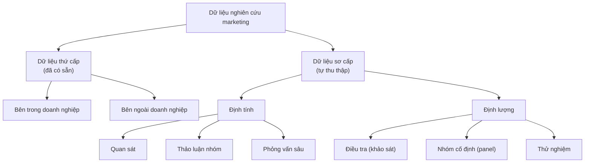

<!-- Bản sao tham chiếu của tài liệu học tập trên Claude Docs (xem ../lms_tai_lieu_hoc_tap.md). Bản trên Claude Docs là bản chính. -->

Học phần MKT1107 Nghiên cứu Marketing · Trường Đại học Kinh tế – Tài chính TP.HCM (UEF) · Giảng viên: Đoàn Nguyễn Bảo Quyên · Tài liệu dùng cho Buổi 7 và 18 giờ tự học của Bài 5.

## Mục tiêu bài học

Học xong bài này, bạn có thể:

1. Phân biệt dữ liệu thứ cấp và sơ cấp; đánh giá được một nguồn dữ liệu thứ cấp.
2. Mô tả các phương pháp định tính: quan sát, thảo luận nhóm, phỏng vấn sâu.
3. Mô tả các phương pháp định lượng: điều tra, nhóm cố định, thử nghiệm.
4. Chọn và biện luận phương pháp thu thập phù hợp cho dự án nhóm, tuân thủ đạo đức nghiên cứu.

## Bản đồ nguồn dữ liệu

**Nguyên tắc:** luôn tìm dữ liệu thứ cấp trước. Chỉ thu thập dữ liệu sơ cấp cho phần thông tin mà dữ liệu thứ cấp không trả lời được.

## 5.1 Dữ liệu thứ cấp

### 5.1.1 Khái niệm

**Dữ liệu thứ cấp** là dữ liệu đã được thu thập trước đó cho một mục đích khác, nay được dùng lại cho nghiên cứu của mình. **Dữ liệu sơ cấp** là dữ liệu do chính nhà nghiên cứu thu thập lần đầu để giải quyết vấn đề nghiên cứu hiện tại.

### 5.1.2 Đặc điểm

| Giá trị | Hạn chế |
|---|---|
| Có sẵn, thu thập nhanh | Thu thập cho mục đích khác nên có thể không khớp với câu hỏi của bạn |
| Chi phí thấp hoặc miễn phí | Định nghĩa, đơn vị đo, cách phân nhóm có thể khác |
| Giúp hiểu bối cảnh, xác định vấn đề | Có thể đã cũ |
| Gợi ý giả thuyết, thang đo, cách chọn mẫu | Độ chính xác phụ thuộc vào người thu thập ban đầu |
| Có khi là nguồn duy nhất (số liệu dân số, quy mô ngành) | |

Vai trò của dữ liệu thứ cấp: hỗ trợ nghiên cứu khám phá và mô tả; giúp hình thành giả thuyết; là nền cho phần tổng quan tài liệu và bối cảnh nghiên cứu.

### 5.1.3 Phân loại

| Nguồn | Ví dụ |
|---|---|
| **Bên trong doanh nghiệp** | Dữ liệu khách hàng (CRM), báo cáo bán hàng, báo cáo tài chính, phản hồi và khiếu nại của khách hàng, số liệu truy cập website |
| **Bên ngoài – cơ quan nhà nước** | Niên giám thống kê và số liệu của cơ quan thống kê quốc gia, báo cáo của các bộ, ngành |
| **Bên ngoài – tổ chức quốc tế, phi chính phủ, hiệp hội** | Báo cáo của Ngân hàng Thế giới, hiệp hội ngành hàng |
| **Bên ngoài – ấn phẩm học thuật** | Bài báo khoa học, sách, luận văn |
| **Bên ngoài – công ty nghiên cứu, báo chí, internet** | Báo cáo ngành của các công ty nghiên cứu thị trường, báo kinh tế, dữ liệu mạng xã hội |

### 5.1.4 Các tiêu chuẩn đánh giá dữ liệu thứ cấp

| Tiêu chuẩn | Câu hỏi kiểm tra |
|---|---|
| **Cụ thể** | Định nghĩa, đơn vị đo, cách phân nhóm có khớp với nhu cầu của mình không? |
| **Chính xác** | Ai thu thập, vì mục đích gì? Phương pháp (mẫu, cách hỏi) có được công bố không? Có nguồn khác đối chiếu được không? |
| **Thời sự** | Dữ liệu thu khi nào? Còn phản ánh đúng hiện tại không? |
| **Phù hợp** | Dữ liệu có thật sự giúp trả lời câu hỏi nghiên cứu không? |

**Cách kiểm tra độ chính xác theo 4 bước:** (1) xác định người/tổ chức công bố; (2) tìm mục đích công bố (có lợi ích thương mại không?); (3) đọc phần phương pháp; (4) đối chiếu với ít nhất một nguồn độc lập.

**Cách cập nhật dữ liệu khi dữ liệu đã cũ:** tìm bản công bố mới hơn của cùng nguồn; tìm nguồn khác có số liệu mới hơn; dùng xu hướng từ chuỗi số liệu nhiều năm để ước lượng (và nói rõ là ước lượng); hoặc bổ sung bằng dữ liệu sơ cấp.

*Ví dụ (giả định):* một bài báo mạng nói “80% Gen Z mua mỹ phẩm online”. Trước khi dùng, nhóm cần tìm số liệu này đến từ khảo sát nào, ai thực hiện, mẫu bao nhiêu người, hỏi ở đâu, năm nào. Không tìm ra nguồn gốc thì không dùng.

## 5.2 Dữ liệu sơ cấp

| | Nghiên cứu định tính | Nghiên cứu định lượng |
|---|---|---|
| Mục đích | Hiểu sâu lý do, động cơ, cảm nhận (“vì sao”, “như thế nào”) | Đo lường, đếm, kiểm định (“bao nhiêu”, “mức độ nào”) |
| Mẫu | Nhỏ, chọn có chủ đích | Lớn hơn, cố gắng đại diện |
| Dữ liệu | Lời nói, hành vi, hình ảnh | Con số |
| Phân tích | Diễn giải, mã hóa theo chủ đề | Thống kê |
| Kết quả | Hiểu biết sâu, không khái quát thành tỷ lệ | Số liệu có thể khái quát (nếu mẫu phù hợp) |

Hai loại thường **kết hợp** (phương pháp hỗn hợp): định tính trước để khám phá và điều chỉnh thang đo, định lượng sau để đo lường trên mẫu lớn.

### 5.2.1 Nghiên cứu định tính

#### a. Quan sát

**Quan sát** là ghi nhận có hệ thống hành vi của con người, sự vật, sự kiện mà không hỏi trực tiếp. Quan sát được phân loại theo 4 chiều:

| Chiều | Hai dạng | Ví dụ (giả định) |
|---|---|---|
| Cách tiếp cận | Trực tiếp (xem hành vi đang diễn ra) / Gián tiếp (xem dấu vết hành vi) | Đứng tại quầy xem khách chọn sản phẩm / đếm hàng trống trên kệ cuối ngày |
| Mức công khai | Công khai (người được quan sát biết) / Ngụy trang (không biết) | Xin phép quan sát cách bạn sử dụng ứng dụng / người mua bí ẩn |
| Mức cấu trúc | Có cấu trúc (phiếu ghi sẵn hạng mục) / Không cấu trúc (ghi mọi điều thấy) | Phiếu đếm số khách theo giờ / nhật ký quan sát tự do |
| Phương tiện | Con người / Thiết bị | Nhân viên quan sát / thiết bị đếm lượt người, số liệu truy cập web |

**Lưu ý:** quan sát có cấu trúc hoặc bằng thiết bị (đếm số lượt, đo thời gian) cho ra **dữ liệu định lượng**. Quan sát không chỉ thuộc về định tính.

**Giới hạn đạo đức:** quan sát ngụy trang chỉ chấp nhận được ở nơi công cộng, không ghi nhận danh tính. Không được dùng camera ẩn, lục tìm rác thải, hay xâm phạm không gian riêng tư. Trong dự án học phần, nhóm chỉ được quan sát công khai hoặc tại nơi công cộng mà không chụp, quay, ghi lại danh tính người khác.

#### b. Thảo luận nhóm tập trung (focus group)

**Thảo luận nhóm** là buổi trao đổi giữa một nhóm nhỏ người tham gia có đặc điểm tương đồng, do một người điều phối (moderator) dẫn dắt theo dàn bài thảo luận.

| Đặc điểm | Thông thường |
|---|---|
| Số người | Khoảng 6–10 người/nhóm |
| Thời lượng | Khoảng 1–2 giờ |
| Người tham gia | Đồng nhất về đặc điểm liên quan (ví dụ cùng là sinh viên đã dùng sản phẩm) để mọi người thoải mái chia sẻ |
| Điểm mạnh | Tương tác giữa người tham gia tạo ý tưởng mới; nhanh, nhiều quan điểm |
| Điểm yếu | Ý kiến bị chi phối bởi người nói nhiều; khó bàn chủ đề nhạy cảm; kết quả phụ thuộc kỹ năng điều phối |

#### c. Phỏng vấn sâu (in-depth interview)

**Phỏng vấn sâu** là cuộc trò chuyện một – một giữa người phỏng vấn và người tham gia, dùng câu hỏi mở và câu hỏi gợi mở thêm (probing) để đi sâu vào suy nghĩ, động cơ.

| Điểm mạnh | Điểm yếu |
|---|---|
| Đi rất sâu vào từng cá nhân | Tốn thời gian cho mỗi người |
| Phù hợp chủ đề nhạy cảm, riêng tư | Phụ thuộc kỹ năng người phỏng vấn |
| Không bị ảnh hưởng bởi ý kiến người khác | Gỡ băng và phân tích mất nhiều công |

*Ví dụ câu hỏi gợi mở thêm:* “Bạn có thể kể thêm về điều đó không?” — “Vì sao bạn cảm thấy như vậy?” — “Lần gần nhất chuyện đó xảy ra là khi nào?”

**Với dự án định tính của nhóm:** phỏng vấn sâu 6–10 người là lựa chọn thực tế nhất; cần xin phép ghi âm trước và ẩn danh người tham gia trong báo cáo.

### 5.2.2 Nghiên cứu định lượng

#### a. Điều tra (khảo sát)

**Điều tra** là thu thập dữ liệu bằng cách hỏi một mẫu người trả lời theo bảng câu hỏi có cấu trúc. Đây là phương pháp phổ biến nhất trong nghiên cứu marketing.

| Hình thức | Ưu điểm | Nhược điểm |
|---|---|---|
| Trực tiếp (mặt đối mặt) | Giải thích được câu hỏi; tỷ lệ trả lời cao; dùng được hình ảnh, mẫu sản phẩm | Tốn thời gian, chi phí; người phỏng vấn có thể ảnh hưởng câu trả lời |
| Điện thoại | Nhanh, phạm vi rộng | Khó hỏi dài; nhiều người từ chối |
| Thư (bưu chính) | Không có ảnh hưởng của người phỏng vấn; người trả lời có thời gian suy nghĩ | Tỷ lệ hồi đáp thấp, chậm; nay ít dùng |
| Trực tuyến (Google Forms, email, mạng xã hội) | Rất rẻ, nhanh; dữ liệu tự động vào bảng tính; dễ rẽ nhánh câu hỏi | Chỉ tiếp cận người dùng internet; khó kiểm soát ai trả lời; dễ có câu trả lời qua loa |

**Với dự án định lượng của nhóm:** khảo sát trực tuyến là lựa chọn thực tế nhất. Để hạn chế nhược điểm: đặt câu hỏi gạn lọc ở đầu bảng hỏi (đúng đối tượng không?), thêm câu hỏi kiểm tra sự chú ý, giới hạn mỗi người trả lời một lần, và ghi rõ kênh phát hành trong phần phương pháp.

#### b. Nhóm cố định (panel)

**Nhóm cố định** là một mẫu người tham gia đồng ý cung cấp thông tin **lặp lại nhiều lần** theo thời gian (ví dụ ghi nhật ký mua sắm hàng tuần). Thường do các công ty nghiên cứu thị trường duy trì.

| Ưu điểm | Nhược điểm |
|---|---|
| Theo dõi được **sự thay đổi** hành vi theo thời gian | Chi phí duy trì cao |
| Dữ liệu chi tiết, liên tục | Thành viên bỏ ngang; hành vi có thể thay đổi vì biết mình đang được theo dõi |

#### c. Thử nghiệm (experiment)

**Thử nghiệm** là phương pháp trong đó nhà nghiên cứu **chủ động thay đổi một yếu tố** (biến độc lập) và đo lường tác động lên một kết quả (biến phụ thuộc), trong khi kiểm soát các yếu tố khác. Đây là phương pháp chính của **nghiên cứu nhân quả** (Bài 1).

- **Nhóm thử nghiệm:** nhận tác động (ví dụ xem quảng cáo mới).
- **Nhóm đối chứng:** không nhận tác động (xem quảng cáo cũ).
- Người tham gia được **phân ngẫu nhiên** vào hai nhóm để hai nhóm tương đương nhau.

| Loại | Mô tả | Ví dụ (giả định) |
|---|---|---|
| Thử nghiệm trong phòng | Môi trường nhân tạo, kiểm soát cao | Cho hai nhóm sinh viên xem hai mẫu bao bì, đo mức ưa thích |
| Thử nghiệm hiện trường | Môi trường thực tế | Hai cửa hàng tương tự, một cửa hàng thử trưng bày mới |
| Thử nghiệm A/B trực tuyến | Hai phiên bản trang web/quảng cáo hiển thị ngẫu nhiên cho người dùng | So sánh tỷ lệ nhấp vào hai màu nút “Mua ngay” |

### 5.2.3 Chọn phương pháp nào?

| Nếu câu hỏi của bạn là… | Phương pháp phù hợp |
|---|---|
| “Vì sao khách hàng…?”, “Họ cảm nhận thế nào…?” | Phỏng vấn sâu, thảo luận nhóm |
| “Khách hàng thực sự làm gì…?” | Quan sát |
| “Bao nhiêu phần trăm…?”, “Yếu tố nào ảnh hưởng…?” | Khảo sát |
| “Hành vi thay đổi thế nào theo thời gian?” | Nhóm cố định |
| “Thay đổi X có **làm** Y tăng không?” | Thử nghiệm |

## Đạo đức khi thu thập dữ liệu sơ cấp

| Nguyên tắc | Nhóm cần làm gì |
|---|---|
| **Tự nguyện và được thông tin** | Giới thiệu mục đích nghiên cứu, thời gian trả lời; người tham gia có quyền từ chối hoặc dừng bất kỳ lúc nào |
| **Xin phép trước khi ghi âm, ghi hình** | Hỏi rõ và chỉ ghi khi được đồng ý |
| **Ẩn danh và bảo mật** | Không thu tên, số điện thoại nếu không cần; trong báo cáo dùng mã (N1, N2…); không đưa dữ liệu có thể nhận diện lên công cụ AI |
| **Không gây hại, không lừa dối** | Không giả danh, không quan sát lén không gian riêng tư |
| **Trung thực với dữ liệu** | Không tự điền phiếu, không dùng AI tạo câu trả lời giả, không sửa số liệu — đây là vi phạm liêm chính học thuật nghiêm trọng |

## Tóm tắt bài học

- Dữ liệu thứ cấp: có sẵn, rẻ, nhanh nhưng phải đánh giá theo 4 tiêu chuẩn (cụ thể, chính xác, thời sự, phù hợp). Luôn tìm thứ cấp trước.
- Định tính (quan sát, thảo luận nhóm, phỏng vấn sâu) trả lời “vì sao”; định lượng (khảo sát, nhóm cố định, thử nghiệm) trả lời “bao nhiêu”.
- Quan sát có cấu trúc hoặc bằng thiết bị có thể cho dữ liệu định lượng.
- Chỉ thử nghiệm (có phân nhóm ngẫu nhiên và nhóm đối chứng) mới cho phép kết luận nhân quả.
- Mọi phương pháp phải tuân thủ đạo đức: tự nguyện, ẩn danh, không gây hại, trung thực với dữ liệu.

## Thuật ngữ chính

| Tiếng Việt | Tiếng Anh |
|---|---|
| Dữ liệu thứ cấp / sơ cấp | Secondary data / primary data |
| Quan sát | Observation |
| Thảo luận nhóm tập trung | Focus group |
| Phỏng vấn sâu | In-depth interview |
| Câu hỏi gợi mở thêm | Probing |
| Điều tra, khảo sát | Survey |
| Nhóm cố định | Panel |
| Thử nghiệm; nhóm đối chứng | Experiment; control group |
| Phương pháp hỗn hợp | Mixed methods |

## Câu hỏi ôn tập

1. Nêu hai giá trị và hai hạn chế của dữ liệu thứ cấp.
2. Dùng 4 tiêu chuẩn để đánh giá một nguồn dữ liệu thứ cấp nhóm bạn đã dùng trong tổng quan tài liệu.
3. Phân biệt quan sát trực tiếp và gián tiếp; công khai và ngụy trang. Giới hạn đạo đức của quan sát ngụy trang là gì?
4. Khi nào nên chọn phỏng vấn sâu thay vì thảo luận nhóm?
5. Khảo sát trực tuyến có những nhược điểm gì và nhóm hạn chế chúng bằng cách nào?
6. Vì sao khảo sát không cho phép kết luận nhân quả chắc chắn như thử nghiệm?
7. Thiết kế một thử nghiệm A/B đơn giản cho một bài đăng quảng cáo: biến độc lập, biến phụ thuộc, hai nhóm.

## Liên hệ dự án nhóm

Sau bài này, nhóm cập nhật mục 4.3.2 của đề cương:

- [ ] Liệt kê dữ liệu thứ cấp sẽ dùng và đánh giá theo 4 tiêu chuẩn
- [ ] Chọn phương pháp thu dữ liệu sơ cấp và giải thích vì sao phù hợp với câu hỏi nghiên cứu
- [ ] Định lượng: nêu kênh phát hành khảo sát và cách gạn lọc người trả lời; có kế hoạch phỏng vấn sơ bộ 3–5 người để điều chỉnh thang đo
- [ ] Định tính: số người phỏng vấn dự kiến, tiêu chí chọn người tham gia, cách xin đồng ý ghi âm
- [ ] Có đoạn cam kết đạo đức: tự nguyện, ẩn danh, bảo mật dữ liệu

## Tài liệu tham khảo

Bojei, J., Che Wel, C. A., & Oh, T. H. (2012). *Marketing research*. Open University Malaysia.

Brown, T. J., Suter, T. A., & Churchill, G. A. (2014). *Basic marketing research: Customer insights and managerial action* (8th ed.). Cengage Learning.

Malhotra, N. K. (2019). *Marketing research: An applied orientation* (7th ed.). Pearson.

Nguyễn, Đ. T. (2011). *Phương pháp nghiên cứu khoa học trong kinh doanh*. NXB Lao động – Xã hội.
