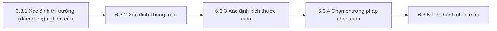

<!-- Bản sao tham chiếu của tài liệu học tập trên Claude Docs (xem ../lms_tai_lieu_hoc_tap.md). Bản trên Claude Docs là bản chính. -->

Học phần MKT1107 Nghiên cứu Marketing · Trường Đại học Kinh tế – Tài chính TP.HCM (UEF) · Giảng viên: Đoàn Nguyễn Bảo Quyên · Tài liệu dùng cho Buổi 8 và 9 giờ tự học của Bài 6.

## Mục tiêu bài học

Học xong bài này, bạn có thể:

1. Giải thích vì sao nghiên cứu thường chọn mẫu thay vì tổng điều tra.
2. Sử dụng đúng các khái niệm: đám đông, phần tử, đơn vị, khung mẫu, hiệu quả chọn mẫu.
3. Thực hiện quy trình chọn mẫu 5 bước và tính kích thước mẫu cơ bản.
4. Phân biệt và áp dụng 4 phương pháp xác suất và 4 phương pháp phi xác suất.
5. Viết phần chọn mẫu và hạn chế về mẫu cho dự án nhóm.

## 6.1 Lý do phải chọn mẫu

**Tổng điều tra (census)** là thu thập dữ liệu từ **tất cả** phần tử của đám đông. **Chọn mẫu (sampling)** là thu thập từ **một bộ phận** rồi dùng kết quả để suy ra đám đông.

Phần lớn nghiên cứu marketing chọn mẫu vì:

| Lý do | Giải thích |
|---|---|
| Chi phí | Hỏi hàng triệu người tiêu dùng là không khả thi về ngân sách |
| Thời gian | Quyết định marketing cần thông tin kịp thời |
| Độ chính xác | Mẫu nhỏ được thực hiện cẩn thận có thể chính xác hơn tổng điều tra làm vội |
| Tính phá hủy | Một số kiểm tra làm hỏng sản phẩm (nếm thử, thử độ bền) |

### Nghịch lý về sai số: vì sao mẫu có thể chính xác hơn tổng điều tra?

Kết quả nghiên cứu có hai loại sai số:

- **Sai số do chọn mẫu (SE):** chênh lệch vì chỉ hỏi một bộ phận. Tổng điều tra không có loại sai số này.
- **Sai số không do chọn mẫu (NE):** sai do ghi chép, câu hỏi khó hiểu, người trả lời qua loa, nhập liệu sai… Loại này tăng mạnh khi quy mô thu thập quá lớn.

Khi chuyển từ tổng điều tra sang chọn mẫu, SE tăng lên nhưng NE có thể giảm nhiều vì đội ngũ nhỏ hơn, được kiểm soát tốt hơn. **Chọn mẫu cho kết quả chính xác hơn khi phần NE giảm được lớn hơn phần SE phát sinh**, tức tổng sai số của mẫu nhỏ hơn tổng sai số của tổng điều tra.

## 6.2 Các khái niệm cơ bản trong chọn mẫu

| Khái niệm | Định nghĩa | Ví dụ (giả định): nghiên cứu thói quen mua trà sữa của sinh viên |
|---|---|---|
| 6.2.1 Đám đông (tổng thể) | Toàn bộ các phần tử có chung đặc điểm mà nhà nghiên cứu quan tâm | Sinh viên Việt Nam |
| 6.2.2 Đám đông nghiên cứu | Đám đông được xác định cụ thể theo phần tử, đơn vị, phạm vi không gian và thời gian | Sinh viên đại học hệ chính quy đang học tại TP.HCM, đã mua trà sữa ít nhất một lần trong 3 tháng qua, khảo sát trong học kỳ này |
| 6.2.3 Phần tử | Đối tượng cung cấp thông tin | Một sinh viên |
| 6.2.4 Đơn vị (đơn vị mẫu) | Đơn vị chứa phần tử, dùng để chọn trong quá trình lấy mẫu; có thể trùng với phần tử | Một lớp học (nếu chọn theo lớp) hoặc một sinh viên |
| 6.2.5 Khung mẫu | Danh sách các đơn vị của đám đông nghiên cứu, dùng để chọn mẫu | Danh sách lớp học phần của một trường (nếu được phép sử dụng) |
| 6.2.6 Hiệu quả chọn mẫu | Hiệu quả **thống kê**: cùng cỡ mẫu, phương pháp nào cho sai số nhỏ hơn thì hiệu quả hơn. Hiệu quả **kinh tế**: cùng mức chính xác, phương pháp nào rẻ hơn thì hiệu quả hơn | — |

**Sai số khung mẫu:** khi khung mẫu không trùng với đám đông nghiên cứu (thiếu người, thừa người, trùng lặp). Ví dụ: dùng danh sách thành viên một nhóm Facebook làm khung mẫu cho “sinh viên TP.HCM” sẽ bỏ sót người không tham gia nhóm.

## 6.3 Quy trình chọn mẫu



### 6.3.3 Xác định kích thước mẫu

Kích thước mẫu phụ thuộc: mức độ tin cậy mong muốn (Z), sai số cho phép (e), mức độ biến thiên của đám đông, kỹ thuật phân tích dự kiến, và nguồn lực. Các công thức dưới đây áp dụng cho **mẫu xác suất ngẫu nhiên đơn giản** với đám đông lớn.

**a. Khi ước lượng giá trị trung bình**

```markdown
n = Z² × σ² / e²

Z: giá trị phân phối chuẩn theo độ tin cậy (95% → Z = 1,96)
σ: độ lệch chuẩn của đám đông (ước từ nghiên cứu trước hoặc nghiên cứu thử)
e: sai số cho phép (cùng đơn vị với biến)

Ví dụ (giả định): ước lượng chi tiêu trà sữa trung bình mỗi tuần,
σ ≈ 40.000 đ, sai số cho phép e = 5.000 đ, độ tin cậy 95%:
n = 1,96² × 40.000² / 5.000² = 3,8416 × 64 ≈ 245,9 → làm tròn lên 246
```

**b. Khi ước lượng tỷ lệ**

```markdown
n = Z² × p(1 − p) / e²

p: tỷ lệ dự kiến; chưa biết thì dùng p = 0,5 (cho cỡ mẫu lớn nhất, an toàn nhất)

Ví dụ: ước lượng tỷ lệ sinh viên đã mua mỹ phẩm nội địa,
độ tin cậy 95%, sai số ±5%:
n = 1,96² × 0,5 × 0,5 / 0,05² = 3,8416 × 0,25 / 0,0025 ≈ 384,2 → 385
```

**c. Quy tắc kinh nghiệm theo kỹ thuật phân tích**

Nhiều nghiên cứu kinh doanh dùng quy tắc kinh nghiệm theo kỹ thuật phân tích:

| Kỹ thuật | Quy tắc thường dùng | Nguồn |
|---|---|---|
| Phân tích nhân tố khám phá (EFA) | Tối thiểu 5 quan sát cho mỗi biến đo lường, tốt hơn là 10; mẫu không dưới 50, nên từ 100 trở lên | Hair và cộng sự (2019) |
| Hồi quy bội | n ≥ 50 + 8m (m là số biến độc lập) | Tabachnick và Fidell (2019) |

*Ví dụ:* bảng hỏi có 24 biến quan sát → theo tỷ lệ 5:1 cần ít nhất 120 người trả lời hợp lệ.

**Lưu ý quan trọng:** công thức a–b chỉ đúng với mẫu xác suất. Với mẫu thuận tiện, tăng cỡ mẫu **không làm mẫu đại diện hơn**; cỡ mẫu khi đó chủ yếu để đủ cho kỹ thuật phân tích. Nên dự trù thêm khoảng 10–20% số phiếu vì sẽ có phiếu không hợp lệ.

### 6.3.4 Xác suất hay phi xác suất?

| | Chọn mẫu xác suất | Chọn mẫu phi xác suất |
|---|---|---|
| Cách chọn | Mỗi phần tử có xác suất được chọn biết trước (khác 0) | Dựa vào sự thuận tiện hoặc phán đoán của nhà nghiên cứu |
| Cần khung mẫu | Có | Không bắt buộc |
| Tính được sai số chọn mẫu | Có | Không |
| Khái quát hóa cho đám đông | Có cơ sở thống kê | Không có cơ sở thống kê |
| Chi phí, thời gian | Cao hơn | Thấp hơn |
| Phù hợp | Nghiên cứu mô tả cần ước lượng cho đám đông | Nghiên cứu khám phá, định tính, thử nghiệm bảng hỏi, ngân sách hạn chế |

## 6.4 Các phương pháp chọn mẫu theo xác suất

### 6.4.1 Ngẫu nhiên đơn giản

Mỗi phần tử trong khung mẫu có cơ hội được chọn **như nhau**. Cách làm: đánh số khung mẫu, rồi bốc thăm hoặc dùng số ngẫu nhiên (ví dụ trong Excel: tạo cột `=RAND()`, sắp xếp theo cột này và lấy n dòng đầu).

- Ưu: đơn giản, dễ hiểu, là nền tảng của các công thức thống kê.
- Nhược: cần khung mẫu đầy đủ; mẫu có thể phân tán địa lý, tốn kém để tiếp cận.

### 6.4.2 Hệ thống

Tính **bước nhảy k = N/n**, chọn ngẫu nhiên một điểm bắt đầu từ 1 đến k, sau đó cứ cách k phần tử lại chọn một.

*Ví dụ:* N = 1.000, n = 100 → k = 10. Bốc ngẫu nhiên được số 7 → chọn các phần tử số 7, 17, 27, …, 997.

- Ưu: dễ thực hiện hơn ngẫu nhiên đơn giản; có thể áp dụng tại hiện trường (cứ 10 khách ra khỏi cửa hàng hỏi một người).
- Nhược: sai lệch nếu danh sách có tính chu kỳ trùng với k.

### 6.4.3 Phân tầng

Chia đám đông thành các **tầng** theo một đặc điểm liên quan đến vấn đề nghiên cứu, sao cho **đồng nhất trong từng tầng, khác biệt giữa các tầng**; sau đó chọn ngẫu nhiên trong mỗi tầng.

*Ví dụ (giả định):* đám đông N = 2.000 sinh viên, cần mẫu n = 200, phân tầng theo năm học.

| Tầng | Số sinh viên | Tỷ trọng | Phân bổ tỷ lệ | Phân bổ không tỷ lệ (ví dụ chia đều) |
|---|---|---|---|---|
| Năm 1 | 800 | 40% | 80 | 50 |
| Năm 2 | 600 | 30% | 60 | 50 |
| Năm 3 | 400 | 20% | 40 | 50 |
| Năm 4 | 200 | 10% | 20 | 50 |
| **Tổng** | **2.000** | **100%** | **200** | **200** |

Phân bổ tỷ lệ giữ đúng cơ cấu đám đông. Phân bổ không tỷ lệ dùng khi cần đủ số lượng để so sánh các tầng nhỏ (năm 4 chỉ có 20 người nếu phân bổ tỷ lệ — quá ít để so sánh); khi tính kết quả chung cần điều chỉnh trọng số.

### 6.4.4 Theo nhóm (cụm)

Chia đám đông thành các **nhóm** có sẵn (lớp học, khu phố, cửa hàng), chọn ngẫu nhiên một số nhóm, rồi:

- **Một bước:** khảo sát tất cả phần tử trong các nhóm được chọn.
- **Hai bước:** chọn ngẫu nhiên tiếp một số phần tử trong mỗi nhóm được chọn.

| | Phân tầng | Theo nhóm |
|---|---|---|
| Bên trong mỗi tầng/nhóm | Đồng nhất | Đa dạng (mỗi nhóm như một đám đông thu nhỏ) |
| Giữa các tầng/nhóm | Khác biệt | Tương tự nhau |
| Chọn | Phần tử từ **mọi** tầng | Chỉ **một số** nhóm |
| Mục tiêu chính | Tăng độ chính xác (hiệu quả thống kê) | Giảm chi phí (hiệu quả kinh tế) |

## 6.5 Các phương pháp chọn mẫu phi xác suất

### 6.5.1 Thuận tiện

Chọn những người **dễ tiếp cận nhất** (bạn bè, người đi ngang qua, thành viên nhóm mạng xã hội).

- Ưu: nhanh, rẻ, dễ làm.
- Nhược: dễ thiên lệch (mẫu giống nhà nghiên cứu); không khái quát hóa được.

### 6.5.2 Phán đoán (có chủ đích)

Nhà nghiên cứu dựa vào hiểu biết để chọn những người **phù hợp nhất** với mục tiêu (chuyên gia, khách hàng trung thành, người vừa đổi thương hiệu). Thường dùng trong nghiên cứu định tính. Kết quả phụ thuộc vào đánh giá của nhà nghiên cứu.

### 6.5.3 Phát triển mầm (quả bóng tuyết)

Chọn một số người tham gia ban đầu (thường chọn có chủ đích), sau đó nhờ họ **giới thiệu** thêm những người có cùng đặc điểm. Phù hợp với đối tượng hiếm, khó tìm (người chơi một môn thể thao ít phổ biến, người sưu tầm đồ cổ). Nhược điểm: mẫu có xu hướng giống nhau vì cùng một mạng lưới quen biết.

### 6.5.4 Định mức (quota)

Xác định tỷ lệ (định mức) theo một hoặc nhiều đặc điểm của đám đông, rồi chọn người trả lời (thuận tiện hoặc phán đoán) cho đến khi đủ định mức. Mẫu có **cơ cấu giống** đám đông theo các đặc điểm đã chọn, nhưng vẫn **không phải mẫu xác suất** vì người trả lời trong mỗi ô không được chọn ngẫu nhiên.

*Ví dụ (giả định) — định mức theo một thuộc tính, n = 100:*

| Nhóm tuổi | Tỷ lệ trong đám đông | Số người cần khảo sát |
|---|---|---|
| 18–30 | 30% | 30 |
| 31–40 | 40% | 40 |
| 41–50 | 30% | 30 |
| **Tổng** | **100%** | **100** |

*Định mức theo hai thuộc tính (tuổi × giới tính), giả định tỷ lệ nam/nữ 50/50 trong mỗi nhóm tuổi:*

| Nhóm tuổi | Nam | Nữ | Tổng |
|---|---|---|---|
| 18–30 (30%) | 15 | 15 | 30 |
| 31–40 (40%) | 20 | 20 | 40 |
| 41–50 (30%) | 15 | 15 | 30 |
| **Tổng** | **50** | **50** | **100** |

Lưu ý: số trong từng dòng phải khớp với tỷ lệ của nhóm tuổi đó — hãy luôn cộng kiểm tra theo dòng và theo cột.

### Tổng hợp 8 phương pháp

| Nhóm | Phương pháp | Dùng khi |
|---|---|---|
| Xác suất | Ngẫu nhiên đơn giản | Có khung mẫu đầy đủ, đám đông không quá phân tán |
| Xác suất | Hệ thống | Có danh sách hoặc dòng người nối tiếp, không có tính chu kỳ |
| Xác suất | Phân tầng | Đám đông gồm các nhóm khác biệt rõ, cần độ chính xác cao |
| Xác suất | Theo nhóm | Đám đông phân tán, có sẵn các nhóm tương tự nhau, cần tiết kiệm |
| Phi xác suất | Thuận tiện | Khám phá, thử bảng hỏi, ngân sách rất hạn chế |
| Phi xác suất | Phán đoán | Định tính, cần người có hiểu biết hoặc trải nghiệm cụ thể |
| Phi xác suất | Phát triển mầm | Đối tượng hiếm, khó tìm |
| Phi xác suất | Định mức | Muốn mẫu có cơ cấu giống đám đông mà không có khung mẫu |

### Với dự án của nhóm

Gần như chắc chắn nhóm sẽ dùng mẫu **thuận tiện** hoặc **định mức** (định lượng) và **phán đoán** (định tính). Điều này hoàn toàn chấp nhận được, miễn là nhóm:

1. Nói đúng tên phương pháp (không gọi mẫu thuận tiện là “ngẫu nhiên”).
2. Mô tả rõ cách tiếp cận người trả lời (kênh nào, thời gian nào, điều kiện gạn lọc).
3. Ghi trong phần hạn chế: kết quả không khái quát hóa thống kê cho toàn bộ đám đông.

## Tóm tắt bài học

- Chọn mẫu tiết kiệm chi phí, thời gian và có thể chính xác hơn tổng điều tra khi sai số không do chọn mẫu giảm được nhiều hơn sai số chọn mẫu phát sinh.
- Đám đông nghiên cứu phải được xác định cụ thể theo phần tử, đơn vị, không gian, thời gian.
- Quy trình 5 bước: đám đông → khung mẫu → kích thước mẫu → phương pháp → tiến hành.
- Cỡ mẫu cho mẫu xác suất: n = Z²σ²/e² (trung bình), n = Z²p(1−p)/e² (tỷ lệ; p = 0,5, e = 5%, 95% → 385).
- Xác suất: ngẫu nhiên đơn giản, hệ thống, phân tầng, theo nhóm. Phi xác suất: thuận tiện, phán đoán, phát triển mầm, định mức.
- Mẫu phi xác suất không cho phép khái quát hóa thống kê — cần nói rõ trong phần hạn chế.

## Thuật ngữ chính

| Tiếng Việt | Tiếng Anh |
|---|---|
| Tổng điều tra / chọn mẫu | Census / sampling |
| Đám đông (tổng thể) nghiên cứu | Target population |
| Phần tử / đơn vị mẫu | Element / sampling unit |
| Khung mẫu | Sampling frame |
| Sai số do chọn mẫu / không do chọn mẫu | Sampling error / non-sampling error |
| Ngẫu nhiên đơn giản / hệ thống | Simple random / systematic sampling |
| Phân tầng / theo nhóm | Stratified / cluster sampling |
| Thuận tiện / phán đoán | Convenience / judgmental sampling |
| Phát triển mầm / định mức | Snowball / quota sampling |

## Bài tập và câu hỏi ôn tập

1. Vì sao một mẫu 400 người được thực hiện cẩn thận có thể chính xác hơn một cuộc tổng điều tra làm vội?
2. Xác định đám đông nghiên cứu (phần tử, đơn vị, không gian, thời gian) cho đề tài của nhóm bạn.
3. Tính cỡ mẫu để ước lượng tỷ lệ với độ tin cậy 95% và sai số ±4%, khi chưa biết p.
4. Một danh sách có 3.000 khách hàng, cần chọn 150 người theo phương pháp hệ thống. Tính k và mô tả cách chọn.
5. Một trường có sinh viên 4 khoa: 1.200 / 900 / 600 / 300 người. Lập bảng phân bổ tỷ lệ cho mẫu n = 150.
6. Lập bảng định mức n = 200 theo giới tính (nữ 60%, nam 40%) và nơi ở (nội thành 70%, ngoại thành 30%), giả định hai đặc điểm độc lập nhau.
7. Phân biệt chọn mẫu phân tầng và định mức. Vì sao mẫu định mức vẫn là phi xác suất?

## Liên hệ dự án nhóm

Cập nhật mục 4.3.3 của đề cương và chương phương pháp:

- [ ] Đám đông nghiên cứu được xác định đủ 4 yếu tố
- [ ] Nêu đúng tên phương pháp chọn mẫu và cách tiếp cận người trả lời
- [ ] Cỡ mẫu dự kiến có căn cứ (công thức hoặc quy tắc kinh nghiệm có trích dẫn) và có dự trù phiếu không hợp lệ
- [ ] Câu hỏi gạn lọc đầu bảng hỏi khớp với định nghĩa đám đông nghiên cứu
- [ ] Đã ghi hạn chế về khái quát hóa nếu dùng mẫu phi xác suất

## Tài liệu tham khảo

Brown, T. J., Suter, T. A., & Churchill, G. A. (2014). *Basic marketing research: Customer insights and managerial action* (8th ed.). Cengage Learning.

Hair, J. F., Black, W. C., Babin, B. J., & Anderson, R. E. (2019). *Multivariate data analysis* (8th ed.). Cengage Learning.

Malhotra, N. K. (2019). *Marketing research: An applied orientation* (7th ed.). Pearson.

Tabachnick, B. G., & Fidell, L. S. (2019). *Using multivariate statistics* (7th ed.). Pearson.
