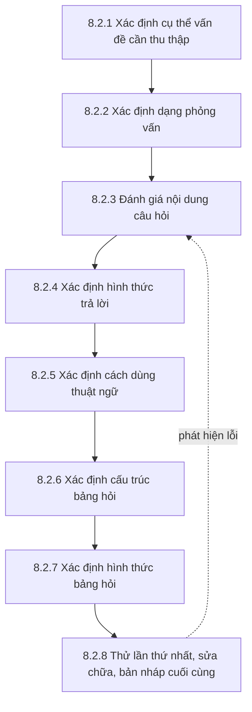

<!-- Bản sao tham chiếu của tài liệu học tập trên Claude Docs (xem ../lms_tai_lieu_hoc_tap.md). Bản trên Claude Docs là bản chính. -->

Học phần MKT1107 Nghiên cứu Marketing · Trường Đại học Kinh tế – Tài chính TP.HCM (UEF) · Giảng viên: Đoàn Nguyễn Bảo Quyên · Tài liệu dùng cho Buổi 10–12 và 18 giờ tự học của Bài 8.

## Mục tiêu bài học

Học xong bài này, bạn có thể:

1. Giải thích vai trò của bảng câu hỏi và hai yêu cầu cơ bản của một bảng hỏi tốt.
2. Thực hiện quy trình thiết kế bảng hỏi 8 bước.
3. Phát hiện và sửa các lỗi thường gặp: câu hỏi kép, dẫn dắt, thang không cân bằng, mơ hồ, bắt ước đoán.
4. Sắp xếp cấu trúc bảng hỏi, trình bày hình thức và thử nghiệm trước khi phát hành.
5. Hoàn thiện bảng hỏi (hoặc dàn bài phỏng vấn) cho dự án nhóm.

## 8.1 Vai trò của bảng câu hỏi

**Bảng câu hỏi** là tập hợp các câu hỏi được sắp xếp theo trình tự hợp lý, dùng để thu thập dữ liệu từ người trả lời một cách thống nhất. Bảng hỏi là cầu nối giữa **mục tiêu nghiên cứu** và **dữ liệu**: câu hỏi nào không phục vụ mục tiêu thì không nên có; mục tiêu nào không có câu hỏi thì sẽ không có dữ liệu để trả lời.

| | Bảng câu hỏi (định lượng) | Dàn bài thảo luận (định tính) |
|---|---|---|
| Câu hỏi | Cố định, chủ yếu là câu hỏi đóng | Linh hoạt, chủ yếu là câu hỏi mở |
| Người dùng | Người trả lời tự điền hoặc phỏng vấn viên đọc nguyên văn | Người phỏng vấn dùng làm khung, có thể hỏi thêm |
| Dữ liệu | Con số, dễ mã hóa | Lời nói, cần gỡ băng và mã hóa theo chủ đề |

**Hai yêu cầu cơ bản** của một bảng hỏi tốt:

1. **Đầy đủ:** thu đủ thông tin cần cho mục tiêu nghiên cứu và kế hoạch phân tích.
2. **Thu hút, dễ trả lời:** người trả lời sẵn lòng trả lời hết và trả lời trung thực (ngắn gọn, rõ ràng, không gây khó chịu).

## 8.2 Quy trình thiết kế bảng hỏi



Quy trình không hoàn toàn tuyến tính: khi thử nghiệm phát hiện lỗi, nhóm quay lại các bước trước để sửa.

### 8.2.1 Xác định cụ thể vấn đề cần thu thập

Từ mục tiêu, câu hỏi nghiên cứu và mô hình, liệt kê **chính xác từng thông tin cần thu**. Cách làm tốt nhất là lập **bảng ánh xạ**:

| Mục tiêu / câu hỏi nghiên cứu | Thông tin cần thu | Câu hỏi trong bảng hỏi | Kỹ thuật phân tích |
|---|---|---|---|
| Xác định đặc điểm mẫu | Giới tính, năm học, mức chi tiêu | Câu 20–22 | Tần số, tỷ lệ |
| Đo mức đánh giá về giá | Nhận thức về giá (GIA1–GIA3) | Câu 5–7 | Trung bình, độ lệch chuẩn |
| So sánh ý định mua theo giới tính | Ý định mua (YD1–YD3), giới tính | Câu 15–17, 20 | Kiểm định khác biệt |

Bảng này giúp phát hiện hai lỗi: câu hỏi **thừa** (không phục vụ mục tiêu nào) và mục tiêu **thiếu** câu hỏi.

### 8.2.2 Xác định dạng phỏng vấn

Cách thu thập quyết định cách viết bảng hỏi:

| Dạng phỏng vấn | Ưu điểm | Nhược điểm | Ảnh hưởng đến thiết kế |
|---|---|---|---|
| Trực diện | Giải thích được; dùng hình ảnh, thẻ trả lời; hỏi được lâu | Tốn kém; người trả lời dễ trả lời theo hướng “đẹp” | Có thể dài hơn, cần hướng dẫn cho phỏng vấn viên |
| Điện thoại | Nhanh, chi phí vừa | Không dùng hình ảnh; khó hỏi câu nhiều lựa chọn dài | Câu ngắn, ít lựa chọn, tổng thời gian ngắn |
| Thư | Không có ảnh hưởng của người phỏng vấn | Tỷ lệ hồi đáp thấp, chậm | Hướng dẫn phải thật rõ vì không ai giải thích |
| Trực tuyến (web, email, mạng xã hội) | Rẻ, nhanh; tự động rẽ nhánh, kiểm tra bắt buộc trả lời; dữ liệu vào thẳng bảng tính | Khó kiểm soát người trả lời; dễ trả lời qua loa | Câu hỏi gạn lọc chặt, câu kiểm tra sự chú ý, tối ưu cho điện thoại |

Với dự án định lượng của nhóm, dạng phổ biến nhất là **trực tuyến** (ví dụ Google Forms).

### 8.2.3 Đánh giá nội dung câu hỏi

Với **mỗi** câu hỏi, tự hỏi bốn câu:

| Câu hỏi kiểm tra | Nếu “không” thì xử lý thế nào |
|---|---|
| 1. Câu hỏi này có **cần thiết** không (phục vụ mục tiêu nào)? | Bỏ câu hỏi |
| 2. Người trả lời có **hiểu** câu hỏi không? | Viết lại đơn giản hơn, giải thích thuật ngữ |
| 3. Người trả lời có **thông tin** để trả lời không (nhớ được, biết được)? | Thêm câu gạn lọc (“Bạn đã từng dùng… chưa?”); rút ngắn khoảng thời gian hỏi lại; thêm lựa chọn “Không nhớ” |
| 4. Người trả lời có **sẵn lòng** trả lời không? | Với câu nhạy cảm: hỏi theo khoảng, đặt cuối bảng hỏi, cam kết ẩn danh, cho phép “Không muốn trả lời” |

Câu hỏi cũng phải **thu đúng dữ liệu cần**: nếu cần biết tần suất mua, đừng hỏi “Bạn có hay mua không?” mà hỏi “Trong tháng qua, bạn mua bao nhiêu lần?”.

*Ví dụ câu hỏi nhạy cảm:* thay vì hỏi “Thu nhập hàng tháng của bạn là bao nhiêu?”, hỏi theo khoảng và để cuối bảng hỏi:

```markdown
Mức chi tiêu hàng tháng của bạn (không tính học phí):
□ Dưới 3 triệu đồng   □ Từ 3 đến dưới 5 triệu   □ Từ 5 đến dưới 7 triệu
□ Từ 7 triệu trở lên    □ Không muốn trả lời
```

Chú ý các khoảng phải **không chồng lấn và không bỏ sót** (“từ 3 đến dưới 5”, không phải “3–5” rồi “5–7”).

### 8.2.4 Xác định hình thức trả lời

**a. Câu hỏi đóng** — cho sẵn các phương án:

| Dạng | Ví dụ |
|---|---|
| Nhị phân | “Bạn đã từng mua sắm qua livestream chưa?” □ Đã từng □ Chưa từng |
| Nhiều lựa chọn – một đáp án | “Bạn thường mua dầu gội ở đâu nhất?” □ Siêu thị □ Cửa hàng tiện lợi □ Sàn thương mại điện tử □ Khác: ____ |
| Nhiều lựa chọn – nhiều đáp án | “Bạn biết đến sản phẩm qua kênh nào? (chọn tất cả các kênh phù hợp)” |
| Xếp hạng | “Xếp hạng 3 yếu tố sau (1 = quan trọng nhất, 3 = ít quan trọng nhất): __ Giá __ Mùi hương __ Bao bì” |
| Thang đo (Likert, đối nghĩa) | Xem Bài 7 |

Lưu ý: phương án phải **đầy đủ** (thêm “Khác” khi cần) và **loại trừ nhau**; số bậc xếp hạng phải bằng số mục.

**b. Câu hỏi mở** — người trả lời tự diễn đạt:

| Ưu điểm | Nhược điểm |
|---|---|
| Thu được ý kiến ngoài dự kiến; phù hợp nghiên cứu khám phá | Khó mã hóa và phân tích |
| Người trả lời không bị gò bó | Tốn công trả lời → nhiều người bỏ trống |

Trong bảng hỏi định lượng, hạn chế câu mở (thường chỉ 1–2 câu, ví dụ góp ý cuối bảng). Trong phỏng vấn định tính, câu mở kèm câu **gợi mở thêm (probing)** là công cụ chính.

### 8.2.5 Xác định cách dùng thuật ngữ

Cách đặt câu quyết định người trả lời hiểu gì và trả lời ra sao. Sáu nguyên tắc:

| Nguyên tắc | Câu chưa tốt (ví dụ giả định) | Vì sao chưa tốt | Câu đã sửa |
|---|---|---|---|
| **1. Đơn giản, quen thuộc** | “Bạn đánh giá thế nào về mức độ omnichannel của thương hiệu X?” | Thuật ngữ chuyên ngành | “Bạn có dễ dàng mua sản phẩm X cả ở cửa hàng lẫn trên mạng không?” |
| **2. Rõ ràng, cụ thể** | “Bạn có thường xuyên uống trà sữa không?” | “Thường xuyên” mỗi người hiểu một khác | “Trong 7 ngày qua, bạn uống trà sữa bao nhiêu lần?” |
| **3. Tránh câu hỏi kép** | “Kem thương hiệu X có ngon và bổ dưỡng không?” | Hỏi hai ý trong một câu: người thấy ngon nhưng không bổ dưỡng không biết trả lời sao | **Tách thành hai câu riêng:** “Kem X có vị ngon” và “Kem X bổ dưỡng”, mỗi câu một thang đo |
| **4. Tránh gợi ý, dẫn dắt** | “Bạn có đồng ý rằng sữa thương hiệu Y, sản phẩm được các mẹ tin dùng, là tốt nhất cho trẻ không?” | Câu hỏi đẩy người trả lời về một đáp án | “Theo bạn, loại sữa nào phù hợp nhất cho trẻ?” (danh sách thương hiệu xếp ngẫu nhiên) |
| **5. Thang đo cân bằng** | “Bạn đánh giá nước trái cây Z: □ Tuyệt vời □ Rất tốt □ Tốt □ Khá □ Kém” | 4 mức tích cực, chỉ 1 mức tiêu cực → kết quả bị đẩy lên | “□ Rất tốt □ Tốt □ Bình thường □ Kém □ Rất kém” |
| **6. Tránh bắt ước đoán, tính toán** | “Mỗi năm gia đình bạn dùng hết bao nhiêu bánh xà bông?” | Người trả lời phải tự cộng dồn, ước đoán | “Một bánh xà bông gia đình bạn thường dùng trong bao lâu?” (nhà nghiên cứu tự quy đổi ra năm) |

Ngoài ra cần tránh: **câu phủ định kép** (“Bạn có không đồng ý rằng không nên…?”), **giả định ngầm** (“Bạn thích điểm gì ở ứng dụng X?” khi chưa biết họ có dùng X không), và các từ tuyệt đối như “lúc nào cũng”, “bao giờ”.

**Khi dịch thang đo từ tiếng Anh:** dịch theo ý chứ không dịch từng chữ; nhờ người khác dịch ngược lại sang tiếng Anh để kiểm tra nghĩa còn giữ được không.

### 8.2.6 Xác định cấu trúc bảng câu hỏi

Bảng hỏi gồm ba phần:

| Phần | Nội dung | Lưu ý |
|---|---|---|
| **1. Phần mở đầu (giới thiệu + gạn lọc)** | Lời chào; người thực hiện; mục đích nghiên cứu; thời gian trả lời dự kiến; cam kết ẩn danh, tự nguyện; câu hỏi gạn lọc | Mục tiêu là **thuyết phục** người trả lời tham gia và **lọc đúng đối tượng**; người không đạt điều kiện được cảm ơn và kết thúc |
| **2. Phần nội dung chính** | Các câu hỏi phục vụ mục tiêu nghiên cứu: hành vi, các thang đo khái niệm | Sắp xếp theo nguyên tắc dưới đây |
| **3. Phần thông tin cá nhân** | Giới tính, năm học, mức chi tiêu… và lời cảm ơn | Để cuối vì nhạy cảm và ít hấp dẫn; chỉ hỏi thông tin thực sự dùng trong phân tích |

**Nguyên tắc sắp xếp phần nội dung chính:**

1. **Phễu (từ chung đến riêng):** hỏi hành vi chung trước, đánh giá cụ thể sau — tránh câu trước ảnh hưởng câu sau.
2. **Dễ trước, khó sau:** câu đầu tiên phải dễ và thú vị.
3. **Nhóm theo chủ đề:** các biến của cùng một khái niệm đặt cạnh nhau, có tiêu đề ngắn dẫn dắt.
4. **Rẽ nhánh hợp lý:** người trả lời “chưa từng dùng” được chuyển qua phần khác, không phải trả lời câu không liên quan.

*Ví dụ (giả định) — phần mở đầu:*

```markdown
Xin chào bạn! Chúng tôi là nhóm sinh viên học phần Nghiên cứu Marketing,
Trường Đại học Kinh tế – Tài chính TP.HCM. Chúng tôi đang tìm hiểu ý kiến của sinh viên
về mỹ phẩm nội địa. Khảo sát mất khoảng 7 phút. Mọi câu trả lời được giữ ẩn danh
và chỉ dùng cho mục đích học tập. Bạn có thể dừng bất kỳ lúc nào.

Câu gạn lọc: Hiện bạn có phải là sinh viên đang học tại TP.HCM không?
□ Có (tiếp tục)   □ Không (cảm ơn và kết thúc)
```

### 8.2.7 Xác định hình thức bảng câu hỏi

- **Đánh số** câu hỏi liên tục; có tiêu đề từng phần.
- **Hướng dẫn** rõ ở đầu mỗi phần (chọn một hay nhiều đáp án; chiều của thang đo).
- **Không ngắt** một câu hỏi sang hai trang; đủ khoảng trắng; cỡ chữ dễ đọc.
- **Độ dài** hợp lý: trả lời trong khoảng 5–10 phút với khảo sát trực tuyến.
- **Mã hóa sẵn** (ghi mã biến, mã số của phương án) để nhập liệu dễ — xem Bài 9.

**Với bảng hỏi trực tuyến** (Google Forms hoặc tương tự):

| Nên làm | Vì sao |
|---|---|
| Dùng dạng “lưới trắc nghiệm” cho các câu Likert cùng thang đo | Gọn, nhất quán |
| Chia bảng hỏi thành nhiều phần (section), dùng rẽ nhánh theo câu trả lời | Người trả lời chỉ thấy câu liên quan |
| Bật “bắt buộc trả lời” cho các câu chính (trừ câu nhạy cảm) | Giảm dữ liệu thiếu |
| Thêm 1 câu kiểm tra sự chú ý (“Để chứng tỏ bạn đang đọc kỹ, hãy chọn mức 2 cho câu này”) | Loại câu trả lời qua loa |
| Kiểm tra hiển thị trên điện thoại | Phần lớn người trả lời dùng điện thoại |
| Không thu email/tên nếu không cần | Bảo đảm ẩn danh |

### 8.2.8 Thử lần thứ nhất, sửa chữa, bản nháp cuối cùng

**Thử nghiệm (pilot)** là cho một nhóm nhỏ người **giống đối tượng khảo sát** trả lời trước khi phát hành chính thức. Đây là bước **không được bỏ qua**: bảng hỏi đã phát hành thì không sửa được nữa.

| Việc cần làm | Chi tiết |
|---|---|
| Chọn người thử | Khoảng 5–10 người thuộc đối tượng khảo sát (không phải thành viên nhóm) |
| Quan sát và hỏi lại | Yêu cầu họ nói to suy nghĩ khi trả lời; hỏi câu nào khó hiểu, khó trả lời, khó chịu |
| Ghi nhận | Thời gian trả lời; câu bỏ trống; câu mà mọi người cùng chọn một đáp án; lỗi rẽ nhánh |
| Thử xử lý | Nhập thử dữ liệu pilot vào phần mềm để chắc chắn phân tích được như kế hoạch |
| Sửa và ghi lại | Sửa bảng hỏi; lập bảng ghi “câu gốc – vấn đề phát hiện – câu đã sửa” (đưa vào chương phương pháp) |
| Bản cuối | Dữ liệu pilot **không gộp** vào dữ liệu chính thức nếu bảng hỏi đã thay đổi |

## Tóm tắt bài học

- Bảng hỏi nối mục tiêu nghiên cứu với dữ liệu; phải đầy đủ và dễ trả lời.
- Quy trình 8 bước, bắt đầu từ bảng ánh xạ mục tiêu → thông tin → câu hỏi → kỹ thuật phân tích.
- Mỗi câu hỏi phải cần thiết, dễ hiểu, người trả lời biết và sẵn lòng trả lời.
- Sáu nguyên tắc từ ngữ: đơn giản, rõ ràng, không kép, không dẫn dắt, thang cân bằng, không bắt ước đoán. Câu kép phải tách thành các câu riêng.
- Cấu trúc 3 phần: mở đầu + gạn lọc → nội dung chính (phễu, dễ trước khó sau) → thông tin cá nhân.
- Luôn thử nghiệm trước khi phát hành và ghi lại các chỉnh sửa.

## Thuật ngữ chính

| Tiếng Việt | Tiếng Anh |
|---|---|
| Bảng câu hỏi / dàn bài thảo luận | Questionnaire / discussion guide |
| Câu hỏi gạn lọc | Screening question |
| Câu hỏi đóng / mở | Closed-ended / open-ended question |
| Câu hỏi kép | Double-barreled question |
| Câu hỏi dẫn dắt | Leading question |
| Thang đo không cân bằng | Unbalanced scale |
| Phễu câu hỏi | Funnel approach |
| Rẽ nhánh | Skip logic / branching |
| Thử nghiệm bảng hỏi | Pilot test / pretest |

## Câu hỏi ôn tập và bài tập

1. Nêu hai yêu cầu cơ bản của bảng hỏi và giải thích vì sao cần bảng ánh xạ mục tiêu – câu hỏi.
2. Chỉ ra lỗi và viết lại các câu sau:
   - (a) “Bạn có thích giá và chất lượng dịch vụ của quán không?”
   - (b) “Bạn có đồng ý rằng giao hàng nhanh là điều ai cũng mong muốn không?”
   - (c) “Mỗi năm bạn chi bao nhiêu tiền cho cà phê?”
   - (d) “Bạn đánh giá ứng dụng: □ Xuất sắc □ Rất tốt □ Tốt □ Tạm được”
   - (e) “Tuổi của bạn: □ Dưới 18 □ 18–20 □ 20–22 □ Trên 22”
3. Vì sao thông tin cá nhân thường đặt cuối bảng hỏi?
4. Viết phần mở đầu và câu gạn lọc cho bảng hỏi của nhóm bạn.
5. Thử nghiệm bảng hỏi giúp phát hiện những vấn đề gì? Vì sao không nên nhờ thành viên nhóm thử?

## Liên hệ dự án nhóm

Bản nháp bảng hỏi nộp kèm bài giữa kỳ (trước Buổi 11); bản hoàn thiện phát hành sau Buổi 12. Tự kiểm tra:

- [ ] Có bảng ánh xạ mục tiêu – câu hỏi – kỹ thuật phân tích; không có câu thừa
- [ ] Phần mở đầu có mục đích, thời gian, cam kết ẩn danh và tự nguyện; có câu gạn lọc
- [ ] Đã rà 6 nguyên tắc từ ngữ cho từng câu; không còn câu kép, dẫn dắt
- [ ] Các khoảng lựa chọn không chồng lấn, không bỏ sót
- [ ] Thử nghiệm với 5–10 người; có bảng ghi các chỉnh sửa
- [ ] Bản trực tuyến đã kiểm tra rẽ nhánh và hiển thị trên điện thoại
- [ ] Nhóm định tính: dàn bài phỏng vấn có phần mở đầu, câu hỏi chính, câu gợi mở thêm và phần kết thúc

## Tài liệu tham khảo

Bojei, J., Che Wel, C. A., & Oh, T. H. (2012). *Marketing research*. Open University Malaysia.

Brown, T. J., Suter, T. A., & Churchill, G. A. (2014). *Basic marketing research: Customer insights and managerial action* (8th ed.). Cengage Learning.

Malhotra, N. K. (2019). *Marketing research: An applied orientation* (7th ed.). Pearson.
