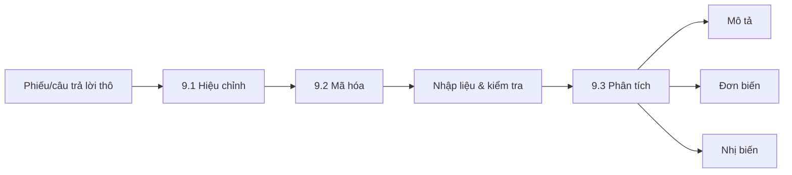

<!-- Bản sao tham chiếu của tài liệu học tập trên Claude Docs (xem ../lms_tai_lieu_hoc_tap.md). Bản trên Claude Docs là bản chính. -->

Học phần MKT1107 Nghiên cứu Marketing · Trường Đại học Kinh tế – Tài chính TP.HCM (UEF) · Giảng viên: Đoàn Nguyễn Bảo Quyên · Tài liệu dùng cho Buổi 13 và 9 giờ tự học của Bài 9.

## Mục tiêu bài học

Học xong bài này, bạn có thể:

1. Hiệu chỉnh (làm sạch) dữ liệu khảo sát và xử lý phiếu lỗi.
2. Mã hóa dữ liệu và lập sổ mã hóa (codebook).
3. Thực hiện và diễn giải phân tích mô tả, đơn biến, nhị biến.
4. Chọn đúng kỹ thuật nhị biến theo cấp thang đo và đọc đúng mức ý nghĩa (p-value).
5. Trình bày kết quả phân tích cho Chương 4 của dự án.

## Hành trình của dữ liệu



Phạm vi yêu cầu của học phần là **mô tả – đơn biến – nhị biến**. Các phân tích sâu hơn (Cronbach’s Alpha, EFA, hồi quy) không bắt buộc và được **điểm cộng**. Sinh viên tự chọn công cụ: SPSS, Jamovi, Excel, Google Sheets…

## 9.1 Hiệu chỉnh dữ liệu

**Hiệu chỉnh** là kiểm tra và xử lý các câu trả lời có vấn đề trước khi phân tích, nhằm bảo đảm dữ liệu **đầy đủ, nhất quán và chính xác**.

### Các lỗi thường gặp

| Lỗi | Ví dụ (giả định) |
|---|---|
| **Bỏ sót** | Bỏ trống một số câu chính |
| **Thiếu logic, mâu thuẫn** | Trả lời “chưa từng dùng” nhưng lại chấm điểm hài lòng với sản phẩm |
| **Trả lời qua loa, giả tạo** | Chọn cùng một mức cho mọi câu (kể cả câu đảo chiều); sai câu kiểm tra sự chú ý; thời gian trả lời quá ngắn |
| **Không hiểu câu hỏi** | Câu trả lời mở không liên quan đến câu hỏi |
| **Ngoài phạm vi** | Người trả lời không thuộc đối tượng khảo sát; giá trị vô lý (tuổi = 200) |

### Cách xử lý

| Mức xử lý | Khi nào dùng |
|---|---|
| Liên hệ lại người trả lời / quay lại hiện trường | Khi còn liên hệ được (phỏng vấn trực tiếp); hiếm khi làm được với khảo sát ẩn danh |
| Gán là giá trị thiếu (missing) | Một vài câu không hợp lệ, phần còn lại của phiếu vẫn dùng được |
| Loại bỏ toàn bộ phiếu | Ngoài đối tượng; sai câu kiểm tra sự chú ý; thiếu nhiều câu chính; trả lời qua loa rõ ràng |

**Nguyên tắc trung thực:** không tự điền thay người trả lời. Ghi lại trong báo cáo: số phiếu thu về, số phiếu loại (và lý do), số phiếu hợp lệ đưa vào phân tích.

## 9.2 Mã hóa dữ liệu

**Mã hóa** là gán ký hiệu (thường là con số) cho các câu trả lời để máy tính xử lý được.

### 9.2.1 Kiểu mã hóa

| Kiểu | Cách làm | Dùng cho |
|---|---|---|
| **Mã hóa trước** | Gán mã ngay khi thiết kế bảng hỏi (ví dụ Nam = 1, Nữ = 2) | Câu hỏi đóng |
| **Mã hóa sau** | Đọc các câu trả lời, nhóm các ý tương tự thành loại, rồi gán mã | Câu hỏi mở, lựa chọn “Khác”, dữ liệu định tính |

Với mã hóa sau: đọc một phần câu trả lời trước để xây dựng danh mục mã, sau đó áp dụng cho toàn bộ và bổ sung mã mới khi cần. Nên có hai người mã hóa độc lập một phần dữ liệu rồi so sánh để thống nhất.

### 9.2.2 Nguyên tắc thiết lập mã

1. **Toàn diện:** mọi câu trả lời có thể có đều có mã (kể cả “Khác”, “Không trả lời”).
2. **Loại trừ lẫn nhau:** mỗi câu trả lời chỉ thuộc một mã (với câu chọn một đáp án).
3. **Nhất quán:** cùng một ý nghĩa thì cùng một mã trong toàn bộ dữ liệu; quy ước thống nhất cho giá trị thiếu.
4. **Dễ hiểu:** tên biến ngắn, có ý nghĩa (GIA1, YD2), không dấu, không khoảng trắng.

**Câu chọn nhiều đáp án:** tách mỗi phương án thành một biến riêng, mã 1 = có chọn, 0 = không chọn.

### Sổ mã hóa (codebook) — ví dụ (giả định)

| Tên biến | Câu hỏi | Giá trị và mã | Cấp thang đo |
|---|---|---|---|
| ID | Mã phiếu | 1, 2, 3… | — |
| GT | Giới tính | 1 = Nam; 2 = Nữ; 3 = Khác | Định danh |
| NHOMTUOI | Nhóm tuổi | 1 = Dưới 18; 2 = Từ 18 đến 25; 3 = Từ 26 trở lên | Thứ tự |
| CHITIEU | Chi tiêu hàng tháng | 1 = Dưới 3 triệu; 2 = Từ 3 đến dưới 5 triệu; 3 = Từ 5 đến dưới 7 triệu; 4 = Từ 7 triệu trở lên | Thứ tự |
| KENH_FB, KENH_TT… | Bạn biết sản phẩm qua kênh nào? (chọn nhiều) | 1 = Có chọn; 0 = Không chọn | Định danh |
| GIA1–GIA3 | Các câu về nhận thức giá | 1 = Hoàn toàn không đồng ý … 5 = Hoàn toàn đồng ý | Quãng (quy ước) |
| SOLAN | Số lần mua trong tháng qua | Số thực tế | Tỷ lệ |
| (mọi biến) | Giá trị thiếu | Để trống (hoặc 99 nếu phần mềm yêu cầu, và khai báo là missing) | — |

Lưu ý các nhóm tuổi và mức chi tiêu phải **liên tục, không bỏ sót, không chồng lấn** (ví dụ “dưới 18” rồi “19–25” sẽ bỏ sót người 18 tuổi). Codebook được đưa vào phụ lục của báo cáo.

## 9.3 Phân tích dữ liệu

### 9.3.1 Phân tích mô tả

Phân tích mô tả tóm tắt dữ liệu của mẫu bằng bảng, biểu đồ và các chỉ số, chưa suy rộng ra đám đông.

| Loại biến | Thống kê phù hợp | Biểu đồ phù hợp |
|---|---|---|
| Định danh (giới tính, kênh mua) | Tần số, tỷ lệ %, yếu vị | Biểu đồ cột, biểu đồ tròn (ít nhóm) |
| Thứ tự (nhóm thu nhập) | Tần số, tỷ lệ %, tỷ lệ tích lũy, trung vị | Biểu đồ cột theo thứ tự |
| Quãng/tỷ lệ (Likert, chi tiêu) | Trung bình, trung vị, độ lệch chuẩn, nhỏ nhất, lớn nhất | Biểu đồ tần số (histogram), biểu đồ cột so sánh trung bình |

**Xu hướng trung tâm:**

- **Yếu vị (mode):** giá trị xuất hiện nhiều nhất — là thống kê trung tâm duy nhất dùng được cho biến định danh.
- **Trung vị (median):** giá trị đứng giữa khi sắp xếp; ít bị ảnh hưởng bởi giá trị cực đoan (hữu ích cho thu nhập, chi tiêu).
- **Trung bình (mean):** tổng các giá trị chia cho số quan sát.

**Độ phân tán:**

- **Khoảng biến thiên:** lớn nhất − nhỏ nhất.
- **Phương sai mẫu:** s² = Σ(x − x̄)² / (n − 1).
- **Độ lệch chuẩn:** s = √s² — cho biết các câu trả lời tản ra quanh trung bình nhiều hay ít.

*Ví dụ (giả định):* 10 người trả lời câu GIA1 (Likert 1–5): 4, 5, 3, 4, 2, 5, 4, 3, 4, 5.

```markdown
Yếu vị = 4 (xuất hiện 4 lần)
Sắp xếp: 2, 3, 3, 4, 4, 4, 4, 5, 5, 5 → Trung vị = (4 + 4) / 2 = 4
Trung bình = 39 / 10 = 3,9
Khoảng biến thiên = 5 − 2 = 3
Σ(x − x̄)² = 8,9 → s² = 8,9 / 9 ≈ 0,99 → s ≈ 0,99

Diễn giải: người trả lời nhìn chung đồng ý rằng giá phù hợp với khả năng chi trả
(trung bình 3,9/5), mức độ đồng thuận tương đối (độ lệch chuẩn khoảng 1 điểm).
```

**Trình bày đặc điểm mẫu** (đầu Chương 4) bằng bảng tần số — ví dụ (giả định), n = 180:

| Đặc điểm | Nhóm | Tần số | Tỷ lệ (%) |
|---|---|---|---|
| Giới tính | Nam | 72 | 40,0 |
| | Nữ | 108 | 60,0 |
| Năm học | Năm 1–2 | 99 | 55,0 |
| | Năm 3–4 | 81 | 45,0 |

Nguồn: Kết quả khảo sát của nhóm (giả định).

### 9.3.2 Phân tích đơn biến

Phân tích đơn biến dùng dữ liệu của **một biến** trong mẫu để **suy ra đám đông**, gồm hai việc: ước lượng và kiểm định giả thuyết. (Về lý thuyết, suy rộng đòi hỏi mẫu xác suất; với mẫu thuận tiện, kết quả chỉ mang tính tham khảo.)

#### a. Ước lượng và khoảng tin cậy

**Sai số chuẩn (SE)** đo mức dao động của giá trị thống kê nếu ta lấy mẫu nhiều lần:

```markdown
SE của trung bình:  SE = s / √n
SE của tỷ lệ:      SE = √[p(1 − p) / n]

Khoảng tin cậy 95%:  giá trị mẫu ± 1,96 × SE
```

*Ví dụ (giả định):* n = 180, điểm trung bình ý định mua x̄ = 3,90, s = 0,90.

```markdown
SE = 0,90 / √180 ≈ 0,90 / 13,42 ≈ 0,067
Khoảng tin cậy 95% = 3,90 ± 1,96 × 0,067 = 3,90 ± 0,13 → [3,77 ; 4,03]

Diễn giải: với độ tin cậy 95%, điểm ý định mua trung bình của đám đông
nằm trong khoảng 3,77 đến 4,03 (nếu mẫu đại diện).
```

#### b. Kiểm định giả thuyết

| Bước | Nội dung |
|---|---|
| 1. Đặt giả thuyết | **H0** (giả thuyết không): không có khác biệt / không có liên hệ. **H1** (giả thuyết đối): có khác biệt / có liên hệ |
| 2. Chọn mức ý nghĩa | Thường α = 0,05 |
| 3. Tính giá trị kiểm định và p-value | Phần mềm tự tính |
| 4. Kết luận | p < 0,05 → **bác bỏ H0**, chấp nhận H1. p ≥ 0,05 → **chưa đủ cơ sở để bác bỏ H0** |

**Lưu ý cách nói:** không viết “chấp nhận H0” hay “chứng minh H0 đúng”. Không tìm thấy bằng chứng khác biệt không có nghĩa là chắc chắn không có khác biệt.

*Ví dụ (giả định):* một báo cáo nói 42% sinh viên dùng ví điện tử X. Nhóm khảo sát ngẫu nhiên 400 sinh viên, thấy 38% dùng X. Tỷ lệ thực có khác 42% không?

```markdown
H0: p = 0,42      H1: p ≠ 0,42      α = 0,05
SE = √(0,42 × 0,58 / 400) ≈ 0,0247
z = (0,38 − 0,42) / 0,0247 ≈ −1,62
|z| = 1,62 < 1,96 (tương đương p ≈ 0,10 > 0,05)
→ Chưa đủ cơ sở để bác bỏ H0: dữ liệu không cho thấy tỷ lệ khác 42% một cách có ý nghĩa thống kê.
```

Với biến định lượng, kiểm định tương tự cho trung bình là **One-sample T-test** (ví dụ: điểm hài lòng trung bình có khác mức trung lập 3 không?).

### 9.3.3 Phân tích nhị biến

Phân tích nhị biến xem xét **mối quan hệ giữa hai biến**, theo hai hướng: **kiểm định khác biệt** (giữa các nhóm) và **kiểm định liên hệ** (hai biến có biến thiên cùng nhau không).

#### Chọn kỹ thuật theo cấp thang đo

| Biến 1 | Biến 2 | Kỹ thuật | Câu hỏi ví dụ (giả định) |
|---|---|---|---|
| Định danh / thứ tự | Định danh / thứ tự | **Bảng chéo + kiểm định Chi-bình phương (χ²)** | Kênh mua sắm ưa thích có liên hệ với giới tính không? |
| Định danh **2 nhóm** | Quãng / tỷ lệ | **Independent-samples T-test** | Ý định mua trung bình của nam và nữ có khác nhau không? |
| Định danh / thứ tự **từ 3 nhóm** | Quãng / tỷ lệ | **One-way ANOVA** | Mức hài lòng có khác nhau giữa các nhóm chi tiêu không? |
| Quãng / tỷ lệ | Quãng / tỷ lệ | **Tương quan Pearson (r)** | Nhận thức về giá có liên hệ với ý định mua không? |

Với biến Likert gồm nhiều câu, trước hết tính **điểm trung bình của khái niệm** (ví dụ GIA = trung bình của GIA1, GIA2, GIA3) rồi dùng biến này để phân tích.

#### Cách đọc kết quả

| Kỹ thuật | Xem gì | Kết luận khi p < 0,05 |
|---|---|---|
| Chi-bình phương | Giá trị χ² và p-value (Sig.); tỷ lệ % theo cột trong bảng chéo | Hai biến có liên hệ; mô tả nhóm nào khác nhóm nào bằng tỷ lệ % |
| T-test | Kiểm định phương sai (Levene) để chọn dòng kết quả phù hợp; rồi p-value của t; trung bình từng nhóm | Trung bình hai nhóm khác nhau; nói rõ nhóm nào cao hơn |
| ANOVA | Kiểm định phương sai; p-value của F; trung bình từng nhóm | Ít nhất hai nhóm khác nhau; dùng kiểm định sau (post-hoc) để biết cặp nào khác |
| Tương quan | Hệ số r (−1 đến +1) và p-value | Có liên hệ tuyến tính; dấu cho biết chiều, |r| càng gần 1 càng mạnh |

**p-value là gì?** Là xác suất quan sát được kết quả như trong mẫu (hoặc khác biệt hơn) **nếu H0 đúng**. p nhỏ nghĩa là kết quả khó xảy ra nếu thực sự không có khác biệt/liên hệ. p **không** cho biết mức độ lớn hay tầm quan trọng thực tế của kết quả — hãy luôn báo cáo kèm các trung bình, tỷ lệ hoặc hệ số r.

*Ví dụ (giả định) — cách viết kết quả T-test:*

```markdown
Điểm ý định mua trung bình của nữ (M = 4,05; SD = 0,82; n = 108) cao hơn của nam
(M = 3,68; SD = 0,95; n = 72). Khác biệt có ý nghĩa thống kê, t(178) = 2,80; p = 0,006.
```

**Tương quan không phải nhân quả.** Nếu chi phí quảng cáo và doanh thu tương quan dương, ta chỉ nói “hai biến có xu hướng tăng cùng nhau”, không nói “quảng cáo làm tăng doanh thu” — có thể có yếu tố thứ ba (mùa cao điểm) tác động đến cả hai. Kết luận nhân quả cần thiết kế thử nghiệm (Bài 5).

## Thực hành trên phần mềm

Bảng dưới đây là đường dẫn tham khảo; tên menu có thể khác chút ít theo phiên bản.

| Việc cần làm | SPSS | Excel / Google Sheets |
|---|---|---|
| Tần số, tỷ lệ | Analyze → Descriptive Statistics → Frequencies | Bảng tổng hợp (PivotTable); hàm `COUNTIF` |
| Trung bình, độ lệch chuẩn | Analyze → Descriptive Statistics → Descriptives | `AVERAGE`, `STDEV.S`, `MEDIAN`, `MODE` |
| Tính điểm trung bình khái niệm | Transform → Compute Variable, `MEAN(GIA1,GIA2,GIA3)` | `=AVERAGE(ô GIA1:ô GIA3)` |
| Bảng chéo + Chi-bình phương | Analyze → Descriptive Statistics → Crosstabs → Statistics → Chi-square | PivotTable + `CHISQ.TEST` |
| T-test hai nhóm độc lập | Analyze → Compare Means → Independent-Samples T Test | `T.TEST` (hoặc Data Analysis ToolPak) |
| ANOVA một yếu tố | Analyze → Compare Means → One-Way ANOVA | Data Analysis ToolPak → Anova: Single Factor |
| Tương quan | Analyze → Correlate → Bivariate | `CORREL`; ToolPak → Correlation |

Jamovi (miễn phí) có các chức năng tương tự trong thẻ Analyses.

**Nhắc lại quy định AI:** không dùng chatbot để tự chạy phân tích hoặc tạo số liệu. Mọi con số trong Chương 4 phải lấy từ kết quả phần mềm của nhóm (đính kèm phụ lục) và nhóm phải giải thích được.

## Tóm tắt bài học

- Hiệu chỉnh → mã hóa → nhập liệu → phân tích; báo cáo số phiếu thu, phiếu loại, phiếu hợp lệ.
- Codebook phải toàn diện, loại trừ, nhất quán; các khoảng giá trị không bỏ sót, không chồng lấn.
- Mô tả: tần số/tỷ lệ cho biến phân loại; trung bình/độ lệch chuẩn cho biến định lượng.
- Đơn biến: khoảng tin cậy = giá trị mẫu ± 1,96 × SE; kiểm định giả thuyết kết luận “bác bỏ” hoặc “chưa đủ cơ sở bác bỏ” H0.
- Nhị biến: chọn Chi-bình phương, T-test, ANOVA hay tương quan theo cấp thang đo và số nhóm.
- p < 0,05 cho biết có ý nghĩa thống kê, không cho biết mức độ lớn; tương quan không phải nhân quả.

## Thuật ngữ chính

| Tiếng Việt | Tiếng Anh |
|---|---|
| Hiệu chỉnh / làm sạch dữ liệu | Data editing / cleaning |
| Mã hóa; sổ mã hóa | Coding; codebook |
| Giá trị thiếu | Missing value |
| Yếu vị, trung vị, trung bình | Mode, median, mean |
| Độ lệch chuẩn; sai số chuẩn | Standard deviation; standard error |
| Khoảng tin cậy | Confidence interval |
| Giả thuyết không / đối | Null / alternative hypothesis |
| Mức ý nghĩa | Significance level (α), p-value |
| Bảng chéo | Cross-tabulation |

## Câu hỏi ôn tập và bài tập

1. Một phiếu trả lời “chưa từng mua” nhưng đánh giá mức hài lòng với sản phẩm là 5. Nhóm nên xử lý thế nào?
2. Lập codebook cho 5 câu hỏi đầu tiên trong bảng hỏi của nhóm bạn.
3. Cho dữ liệu: 3, 4, 4, 5, 2, 4, 3, 5. Tính yếu vị, trung vị, trung bình, độ lệch chuẩn mẫu.
4. n = 250, x̄ = 3,6, s = 1,0. Tính khoảng tin cậy 95% cho trung bình.
5. Chọn kỹ thuật phân tích cho: (a) giới tính × kênh mua ưa thích; (b) năm học (4 nhóm) × điểm hài lòng; (c) số giờ dùng mạng xã hội × chi tiêu mua sắm trực tuyến.
6. Một T-test cho p = 0,23. Viết câu kết luận đúng.
7. Vì sao không thể kết luận “X làm tăng Y” chỉ từ hệ số tương quan r = 0,6?

## Liên hệ dự án nhóm

Thu dữ liệu hoàn tất trong Buổi 13; Chương 4 (định lượng) cần:

- [ ] Báo cáo số phiếu thu về, số phiếu loại (lý do), số phiếu hợp lệ
- [ ] Bảng đặc điểm mẫu (tần số, tỷ lệ)
- [ ] Bảng thống kê mô tả các biến quan sát và điểm trung bình từng khái niệm
- [ ] Ít nhất một phân tích nhị biến trả lời câu hỏi nghiên cứu, có diễn giải đúng cách
- [ ] Kết luận về giả thuyết dùng đúng cách nói (bác bỏ / chưa đủ cơ sở bác bỏ H0)
- [ ] Codebook và kết quả gốc từ phần mềm đặt trong phụ lục
- [ ] (Điểm cộng) Cronbach’s Alpha, EFA hoặc hồi quy, có trích dẫn tiêu chuẩn đánh giá

Nhóm định tính: gỡ băng, mã hóa theo chủ đề (mã hóa sau), trình bày bảng chủ đề kèm trích dẫn nguyên văn đã ẩn danh.

## Tài liệu tham khảo

Hair, J. F., Black, W. C., Babin, B. J., & Anderson, R. E. (2019). *Multivariate data analysis* (8th ed.). Cengage Learning.

Lê, Q. H., Nguyễn, Q. T., Nguyễn, T. N. Á., Trần, T. H., Lê, H. N., & Nguyễn, N. D. (2023). *Ứng dụng SPSS – AMOS – PLS phân tích dữ liệu trong kinh doanh*. NXB Tài chính.

Malhotra, N. K. (2019). *Marketing research: An applied orientation* (7th ed.). Pearson.
